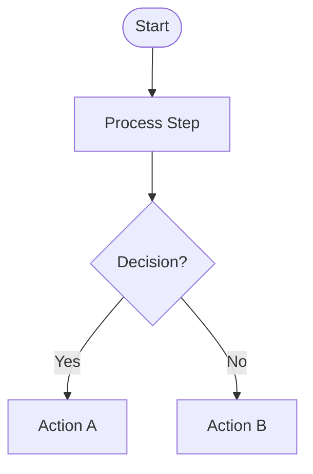
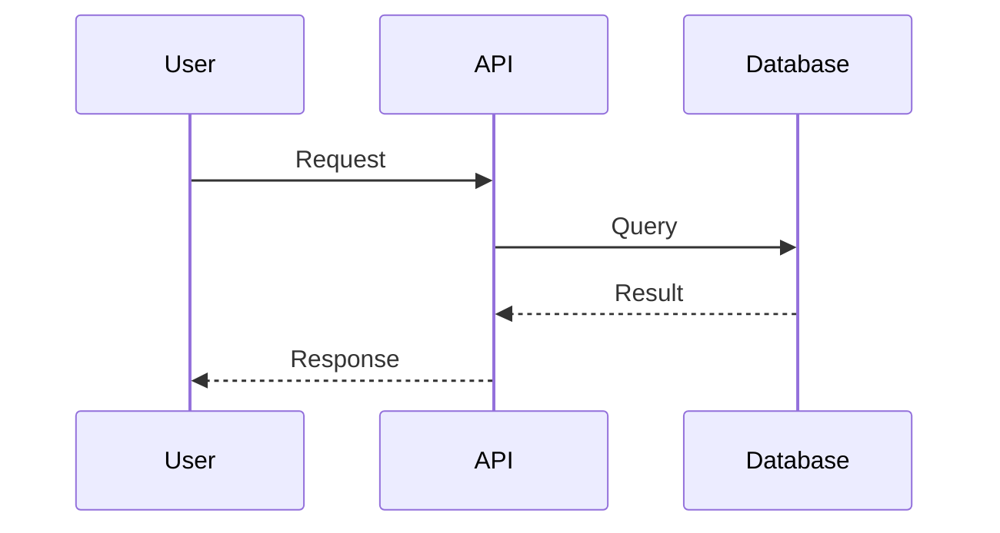
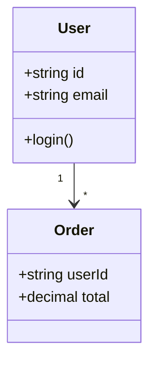
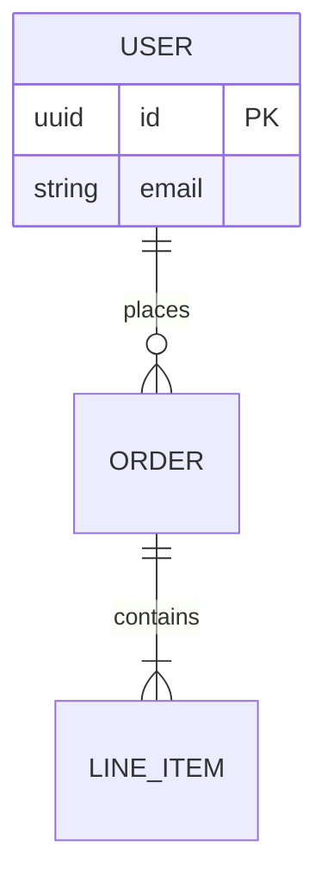
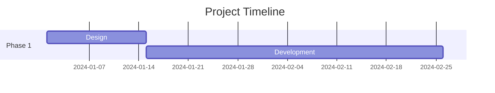
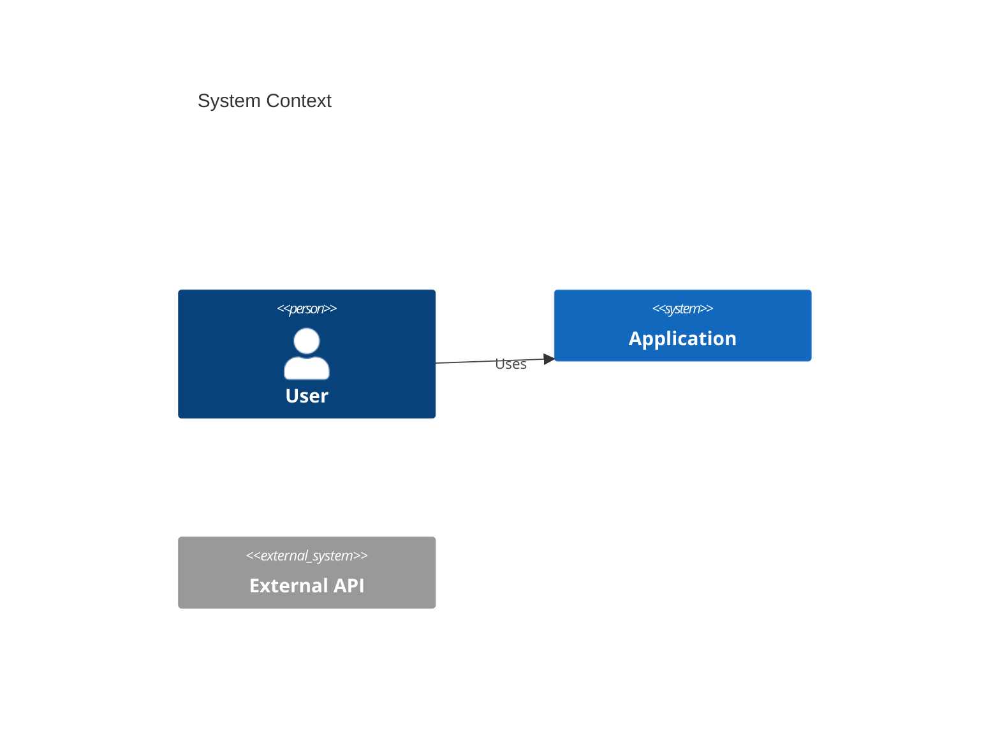
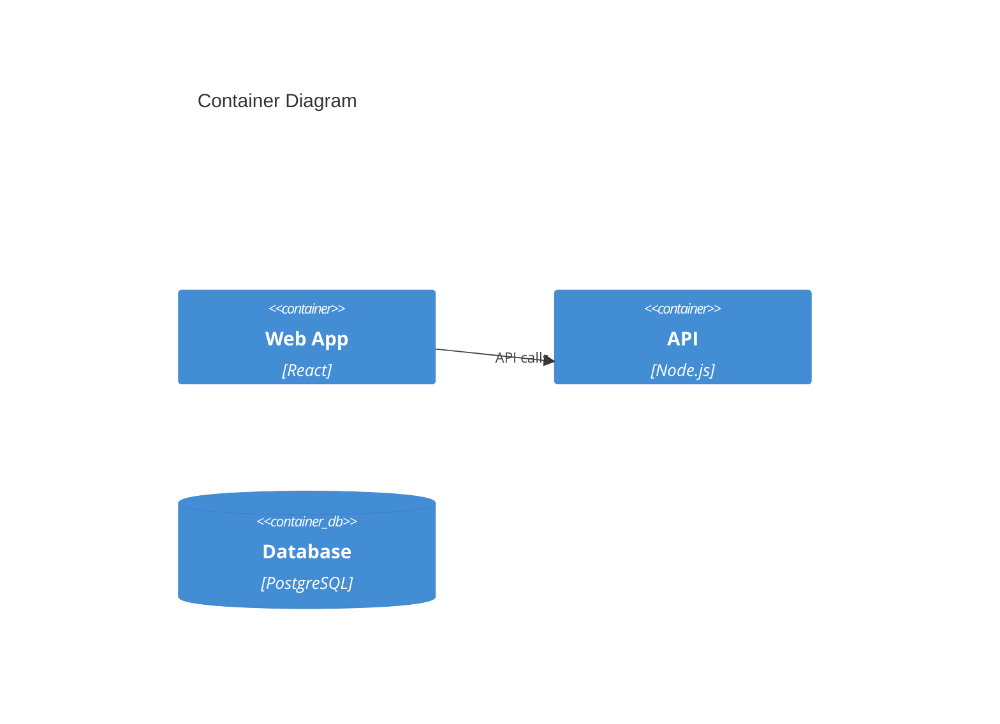
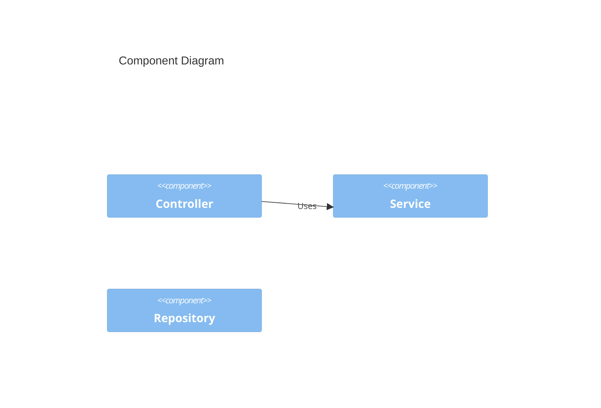

# Common Engineering Plugin

Foundational engineering tools for software diagram generation, documentation, and common development tasks. This plugin provides commands and agents to help you create professional software diagrams in Mermaid format.

## Features

- **Generate diagrams from descriptions or documents** - Create diagrams from text descriptions or requirement files
- **Auto-generate diagrams from code** - Analyze your codebase to automatically create architecture diagrams
- **Orchestrated diagram generation** - Use the diagram-architect agent for complex, multi-diagram documentation
- **Multiple diagram types** - Support for flowcharts, sequence, class, ER, Gantt, and C4 diagrams
- **Flexible output** - Display in console or save to files

## Installation

### Add this marketplace (if not already added)

```bash
/plugin marketplace add /Users/irfanputra/Personal/my-claude-code-marketplace
```

### Install the plugin

```bash
/plugin install common-engineering@my-claude-code-marketplace
```

### Enable the plugin

```bash
/plugin enable common-engineering@my-claude-code-marketplace
```

## Available Commands

### 1. `/common-engineering:generate-diagram`

Generate software diagrams from text descriptions or requirement documents.

**Syntax:**
```bash
/common-engineering:generate-diagram <type> <description-or-file> [--save <path>]
```

**Supported Types:**
- `flowchart` - Process flows and decision trees
- `sequence` - Interaction/sequence diagrams
- `class` - UML class diagrams
- `er` - Entity-relationship diagrams
- `gantt` - Project timeline/Gantt charts
- `c4-context` - C4 system context diagram
- `c4-container` - C4 container diagram
- `c4-component` - C4 component diagram

**Examples:**

```bash
# Generate from inline description
/common-engineering:generate-diagram sequence "User login: submit credentials, validate, return JWT token"

# Generate from requirements file
/common-engineering:generate-diagram c4-context ./docs/requirements.md

# Generate and save to file
/common-engineering:generate-diagram flowchart ./docs/process.md --save docs/diagrams/process-flow.md

# Generate C4 container diagram
/common-engineering:generate-diagram c4-container "E-commerce system: Web App (React), API (Node.js), Database (PostgreSQL), Cache (Redis)"

# Generate Gantt chart
/common-engineering:generate-diagram gantt "Project: Design (2 weeks), Development (6 weeks), Testing (2 weeks), Deployment (1 week)"

# Generate ER diagram
/common-engineering:generate-diagram er "Database schema: Users table with id, email, name. Orders table with id, user_id, total. One user has many orders."
```

### 2. `/common-engineering:diagram-from-code`

Auto-generate diagrams by analyzing your codebase structure.

**Syntax:**
```bash
/common-engineering:diagram-from-code <directory> <type> [--save <path>]
```

**Supported Types:**
- `class` - UML class diagrams from OOP code
- `sequence` - Sequence diagrams from method calls
- `er` - ER diagrams from models/schemas
- `c4-container` - Container diagram from project structure
- `c4-component` - Component diagram from module organization

**Examples:**

```bash
# Generate class diagram from models
/common-engineering:diagram-from-code ./src/models class

# Generate C4 component diagram from API service
/common-engineering:diagram-from-code ./services/api c4-component --save docs/api-architecture.md

# Generate ER diagram from database models
/common-engineering:diagram-from-code ./database/models er

# Generate C4 container diagram from entire project
/common-engineering:diagram-from-code . c4-container
```

## Available Agents

### `diagram-architect`

Multi-step orchestrator for generating comprehensive diagrams from requirements, documents, or code.

**Capabilities:**
- Read and analyze requirement documents (PRDs, specs, design docs)
- Generate complete diagram sets (e.g., full C4 suite)
- Analyze codebases to auto-generate architecture diagrams
- Create comprehensive documentation with embedded diagrams
- Iterative diagram refinement based on feedback

**Example Usage:**

```bash
# Invoke the agent (in Claude Code chat)
"I need the diagram-architect agent to read docs/requirements.md and generate all relevant architecture diagrams"

"Use diagram-architect to analyze ./services and create a complete C4 diagram set with documentation"

"diagram-architect: create comprehensive architecture documentation for the API service with C4 diagrams, sequence diagrams for key flows, and ER diagram for data model"
```

## Diagram Types Guide

### Flowchart
Best for: Process flows, decision trees, algorithms, state machines

**Example:**


### Sequence Diagram
Best for: User interactions, API flows, system integrations

**Example:**


### Class Diagram
Best for: Object-oriented design, data structures, inheritance

**Example:**


### ER Diagram
Best for: Database schemas, data models, entity relationships

**Example:**


### Gantt Chart
Best for: Project timelines, sprint planning, task scheduling

**Example:**


### C4 Context Diagram
Best for: System overview, external integrations, stakeholder view

**Example:**


### C4 Container Diagram
Best for: System architecture, service boundaries, technology stack

**Example:**


### C4 Component Diagram
Best for: Internal structure, module organization, component dependencies

**Example:**


## Common Workflows

### Create Architecture Documentation from Requirements

```bash
# 1. Generate C4 context diagram
/common-engineering:generate-diagram c4-context ./docs/prd.md --save docs/architecture/01-context.md

# 2. Generate C4 container diagram
/common-engineering:generate-diagram c4-container ./docs/prd.md --save docs/architecture/02-containers.md

# 3. Generate sequence diagrams for key flows
/common-engineering:generate-diagram sequence ./docs/user-flows.md --save docs/architecture/03-sequence.md

# 4. Generate ER diagram
/common-engineering:generate-diagram er ./docs/data-model.md --save docs/architecture/04-data.md
```

### Analyze Existing Codebase

```bash
# 1. Generate overall container architecture
/common-engineering:diagram-from-code . c4-container --save docs/architecture.md

# 2. Generate component diagram for each service
/common-engineering:diagram-from-code ./services/api c4-component --save docs/api-components.md

# 3. Generate class diagram from models
/common-engineering:diagram-from-code ./src/models class --save docs/class-diagram.md
```

### Use Agent for Comprehensive Documentation

```
"diagram-architect: Read the PRD at ./docs/product-requirements.md and create comprehensive architecture documentation with:
- C4 context diagram showing system boundaries
- C4 container diagram showing services and tech stack
- C4 component diagrams for each major service
- Sequence diagrams for 3 key user flows
- ER diagram for the data model
- Save everything to docs/architecture.md"
```

## Tips and Best Practices

### Diagram Generation
- **Start high-level**: Create C4 context first, then drill down to containers and components
- **Keep it focused**: 5-15 elements per diagram for clarity
- **Use consistent naming**: Match names in code, requirements, and diagrams
- **Add context**: Include brief descriptions with each diagram

### File Organization
- Save diagrams in a `docs/` or `docs/diagrams/` directory
- Use descriptive filenames: `user-auth-sequence.md`, `api-architecture.md`
- Create an index file linking to all diagrams

### Diagram Maintenance
- Update diagrams when architecture changes
- Version control diagram files with code
- Review diagrams during architecture reviews
- Use `diagram-from-code` to verify diagrams match implementation

### Working with Mermaid
- Diagrams are in Mermaid format and render in GitHub, GitLab, and many markdown viewers
- Preview diagrams using [Mermaid Live Editor](https://mermaid.live/)
- Embed in documentation using markdown code blocks with `mermaid` language tag

## Extending This Plugin

This plugin is designed to be extended with additional engineering capabilities:

**Future additions could include:**
- Shell script generation and optimization
- Engineering documentation templates (API docs, README generators)
- Code review checklists
- Architecture decision record (ADR) templates
- And more...

## Troubleshooting

### Command not found
```bash
# Ensure plugin is installed and enabled
/plugin
# Look for "common-engineering" in the list, ensure it shows as enabled
```

### File path not found
- Use absolute paths or paths relative to current working directory
- Check file exists: `ls ./docs/requirements.md`

### Diagram not rendering
- Verify Mermaid syntax using [Mermaid Live Editor](https://mermaid.live/)
- Check for proper indentation and closing brackets
- Ensure diagram type is spelled correctly

### Agent not responding
- Make sure to explicitly mention "diagram-architect" or invoke agent in chat
- Provide clear requirements or file paths to analyze
- Be specific about desired outputs

## Version History

- **v1.0.0** - Initial release with diagram generation commands and architect agent

## Contributing

This is a personal plugin marketplace. To add features:

1. Edit command files in `commands/`
2. Update agent instructions in `agents/`
3. Test with `/plugin uninstall` and `/plugin install`
4. Update this README with new features

## License

Personal use only.

## Author

Created by irfansofyana
