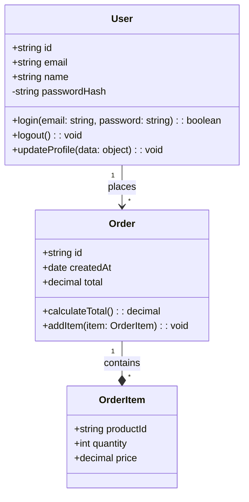
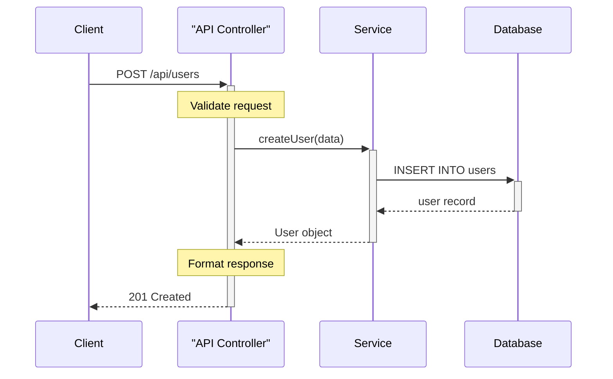
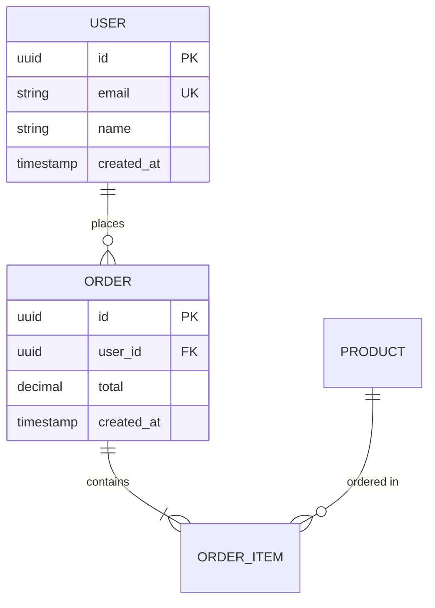
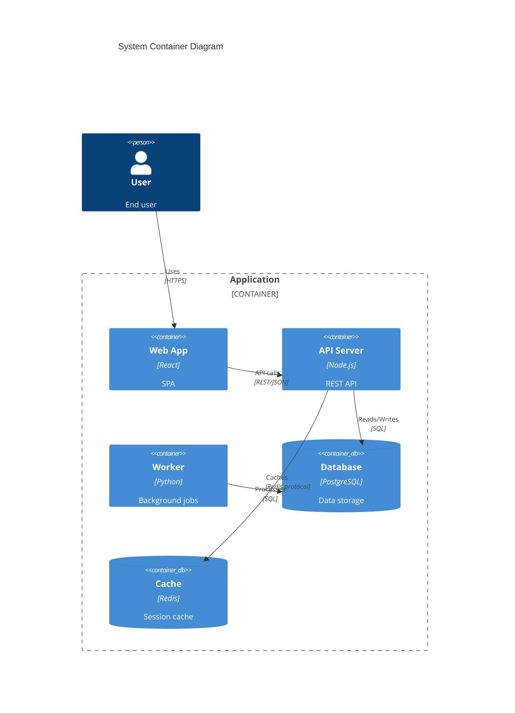
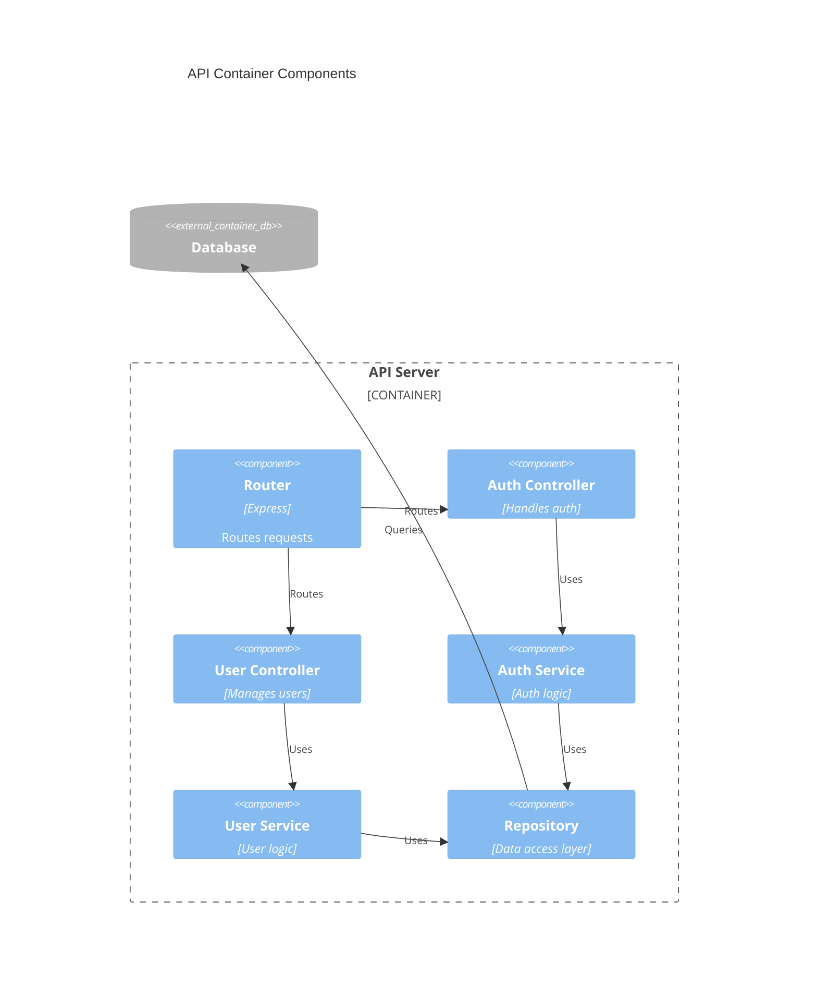

# Generate Diagram from Code

Automatically generate software diagrams by analyzing the structure of your codebase.

## Supported Diagram Types

- `class` - UML class diagrams from OOP code
- `sequence` - Sequence diagrams from method calls and interactions
- `er` - Entity-relationship diagrams from models/schemas
- `c4-container` - C4 container diagram from project structure
- `c4-component` - C4 component diagram from module organization

## CRITICAL: Mermaid Syntax Rules

**You MUST follow these syntax rules to prevent diagram generation errors:**

### Reserved Words and Keywords

1. **The word "end" MUST be capitalized** in all contexts
   - ✅ CORRECT: Capitalize in loops, conditionals: `loop` ... `End`
   - ❌ INCORRECT: `end` - Will break the parser

2. **Avoid "o" and "x" as first characters** in node/component IDs
   - ❌ INCORRECT: `ops[Operations]` may create circle edge
   - ✅ CORRECT: `Ops[Operations]` or `operations[Operations]`

### Special Characters and Escaping

3. **Always wrap text with special characters in double quotes**
   - Use HTML entity codes inside quotes:
     - `#quot;` for ", `#35;` for #, `#40;` for (, `#41;` for )
   - ✅ CORRECT: `["API #40;v2#41;"]` displays "API (v2)"
   - ❌ INCORRECT: `[API (v2)]` will break

4. **Participant/Entity names with spaces require quotes**
   - ✅ CORRECT: `participant API as "API Server"`
   - ✅ CORRECT: `"ORDER ITEM" {` for ER diagrams
   - ❌ INCORRECT: `participant API Server`

### Version and Compatibility

5. **Minimum Mermaid version: v10.7.0+**
   - C4 diagrams are EXPERIMENTAL (syntax may change)
   - Test generated diagrams in Mermaid editor before saving

### Validation Checklist

6. **Before outputting any diagram, validate:**
   - ✓ No lowercase "end" keywords
   - ✓ All special characters escaped with HTML entities
   - ✓ Participant names properly quoted and aliased
   - ✓ Proper spacing and indentation
   - ✓ Methods have `()`, attributes don't (for class diagrams)

## Arguments

- `$1` - Directory path to analyze (e.g., `./src`, `./models`, `.`)
- `$2` - Diagram type (one of the supported types above)
- `$3` and `$4` - Optional: `--save` flag followed by output file path

## Instructions

Follow these steps to auto-generate diagrams from code:

### Step 1: Validate Arguments

1. Extract directory path from `$1`
2. Extract diagram type from `$2`
3. Validate diagram type is one of: `class`, `sequence`, `er`, `c4-container`, `c4-component`
4. If invalid, show error with list of valid types

### Step 2: Scan the Codebase

1. Use the Glob tool to find relevant files in the directory:
   - For `class`: `**/*.{js,ts,py,java,go,rb,php,cs}` (OOP language files)
   - For `sequence`: `**/*.{js,ts,py,java,go}` (files with function calls)
   - For `er`: `**/models/**/*.{js,ts,py}` or `**/schema/**/*.sql`
   - For `c4-container`: Top-level directories and major modules
   - For `c4-component`: Module structure within a service/container

2. Limit to first 20-30 relevant files to avoid overwhelming analysis
3. If no files found, show error and suggest checking the directory path

### Step 3: Analyze Code Structure

Use the Read tool to analyze key files and extract:

#### For Class Diagrams:
- Class/interface definitions
- Properties and their types
- Methods and their signatures
- Inheritance relationships (extends, implements)
- Composition/aggregation (class properties that are other classes)
- Access modifiers (public, private, protected)

**Analysis pattern:**
```
Look for: class ClassName, interface IName, extends, implements
Extract: class names, attributes, methods, relationships
```

#### For Sequence Diagrams:
- Function/method definitions
- Method calls between classes/modules
- API calls or service interactions
- Database queries
- External service calls

**Analysis pattern:**
```
Look for: function calls, method invocations, API requests
Trace: caller → callee relationships
```

#### For ER Diagrams:
- Model/entity definitions
- Fields/columns and their types
- Relationships (hasMany, belongsTo, foreign keys)
- Constraints (unique, required, primary key)

**Analysis pattern:**
```
Look for: model definitions, schema files, associations
Extract: entities, attributes, relationships, cardinality
```

#### For C4 Container Diagrams:
- Top-level directories (web, api, database, etc.)
- Major technology stacks (React, Node.js, PostgreSQL)
- Service boundaries
- Inter-service communication

**Analysis pattern:**
```
Look for: package.json, requirements.txt, go.mod, docker-compose.yml
Identify: containers, technologies, dependencies
```

#### For C4 Component Diagrams:
- Module/package organization
- Component structure within a container
- Internal dependencies
- Layers (controller, service, repository)

**Analysis pattern:**
```
Look for: directory structure, imports, module exports
Map: components and their relationships
```

### Step 4: Generate Mermaid Diagram

Based on the analyzed code structure, generate a Mermaid diagram:

#### Class Diagram Example


**Key Points for Class Diagrams from Code:**
- Methods MUST have `()` - detect function/method definitions in code
- Attributes do NOT have `()` - detect properties/fields
- Include type information from code annotations
- Show actual visibility from code (`+` public, `-` private, `#` protected)

#### Sequence Diagram Example


**Key Points for Sequence Diagrams from Code:**
- Use aliases for cleaner diagrams: `participant C as Client`
- Quote names with spaces: `participant API as "API Controller"`
- Add activation with `+` and `-` suffixes
- Include notes for important logic steps
- Trace actual method calls from code

#### ER Diagram Example


#### C4 Container Example

**⚠️ WARNING: C4 diagrams are EXPERIMENTAL. Syntax may change in future Mermaid versions.**



**Key Points for C4 Container from Code:**
- Use `Container_Boundary` (not `System_Boundary`) in container diagrams
- Detect containers from: package.json, docker-compose.yml, Dockerfile
- Include technology stack from dependency files
- Show all containers within the system boundary

#### C4 Component Example


### Step 5: Add Analysis Summary

Before or after the diagram, include a brief summary:

```markdown
## Code Analysis Summary

**Directory analyzed:** {directory}
**Files scanned:** {count}
**Diagram type:** {type}

### Key findings:
- {finding 1}
- {finding 2}
- {finding 3}
```

### Step 6: Output the Diagram

1. Check if `$3` is `--save` and `$4` contains a file path
2. **If --save flag present**:
   - Use the Write tool to save the diagram and summary to the file
   - Show success message: "Diagram generated from code and saved to {path}"
3. **If no --save flag**:
   - Display the analysis summary and diagram in console
   - Add note: "Diagram auto-generated from {directory}"

### Guidelines for Code Analysis

1. **Focus on key structures** - Don't try to include every class/function
2. **Limit complexity** - Show 5-15 main entities/components
3. **Infer relationships** from:
   - Import/require statements
   - Type annotations
   - Method parameters
   - Database foreign keys
4. **Use meaningful names** from actual code identifiers
5. **Group related items** (e.g., all controllers together)
6. **Identify patterns** (MVC, layered architecture, microservices)
7. **Handle multiple languages** - adapt analysis based on file extensions

### IMPORTANT: Layout and Visual Presentation

**Apply the same layout principles as the generate-diagram command.**

#### Layout for Readability

1. **Organize by architecture layers**:
   - Top layer: Controllers/Handlers
   - Middle layer: Services/Business Logic
   - Bottom layer: Repositories/Data Access
   - Databases at the very bottom

2. **Group related components**:
   - Use boundaries/subgraphs for modules
   - Keep related classes near each other
   - Minimize crossing lines between components

3. **Direction**:
   - Use `TD` (top-down) for layered architectures
   - Use `LR` (left-right) for pipeline/flow architectures
   - Arrange components to show clear data flow

4. **Keep diagrams clean**:
   - Use minimal styling - focus on structure and relationships
   - Ensure text labels are clear and readable
   - Use Mermaid's default styling for consistency

### Error Handling

- If directory doesn't exist: Show error with correct path format
- If no relevant files found: Suggest checking directory or trying parent directory
- If code is too complex: Generate simplified diagram with note
- If unable to parse: Fall back to directory structure-based diagram

### Technology Detection

When analyzing, detect technologies from:
- `package.json` → Node.js, React, etc.
- `requirements.txt` or `pyproject.toml` → Python
- `go.mod` → Go
- `pom.xml` or `build.gradle` → Java
- `Gemfile` → Ruby
- `.csproj` → C#
- Docker files → Containerization
- Database migration files → Database type

## Examples

**Example 1: Class diagram from models**
```bash
/common-engineering:diagram-from-code ./src/models class
```

**Example 2: C4 component diagram with save**
```bash
/common-engineering:diagram-from-code ./services/api c4-component --save docs/api-architecture.md
```

**Example 3: ER diagram from database schemas**
```bash
/common-engineering:diagram-from-code ./database/models er
```

## Best Practices

- Analyze focused directories (e.g., `./src/models` vs entire repo)
- For large codebases, generate multiple focused diagrams
- Review and refine auto-generated diagrams
- Combine with manual diagram commands for complex scenarios
- Use this for initial architecture documentation, then maintain manually
