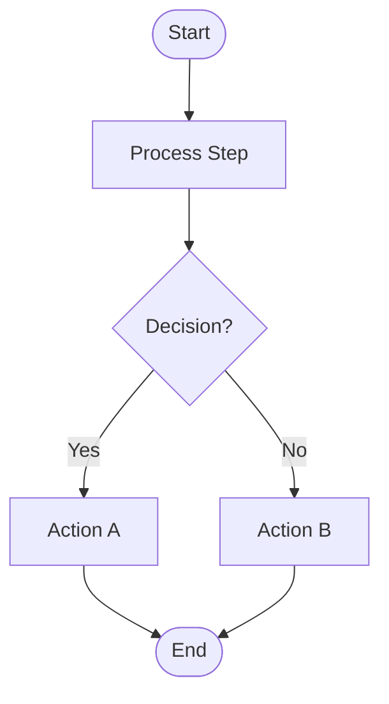
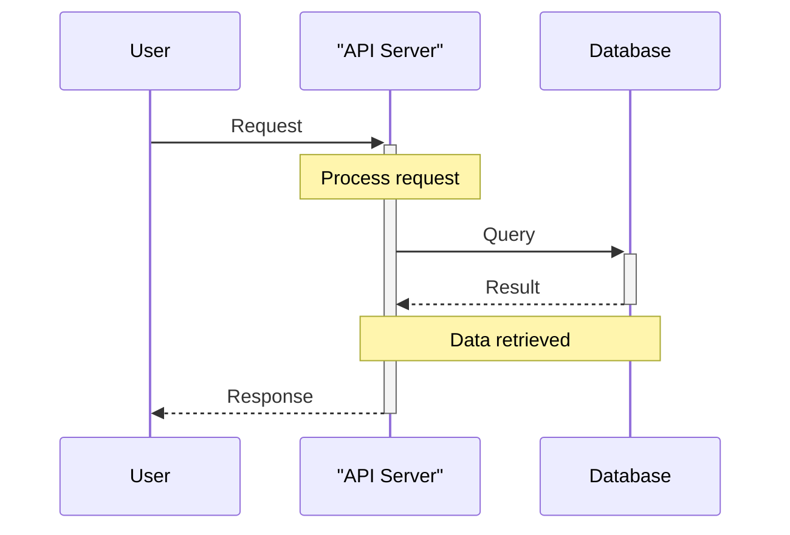
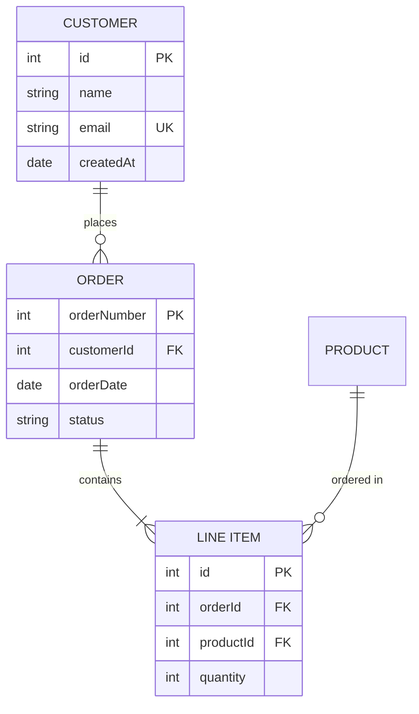
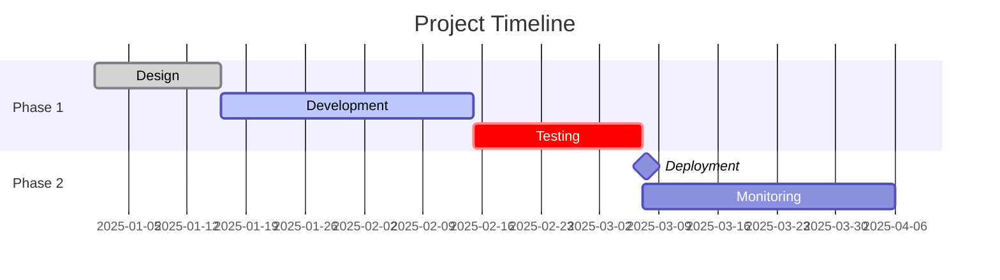
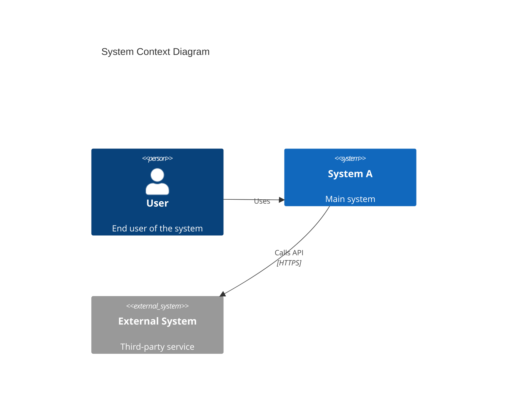
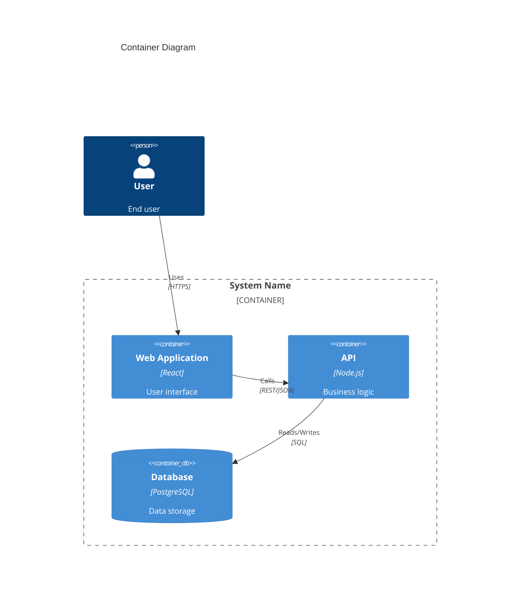
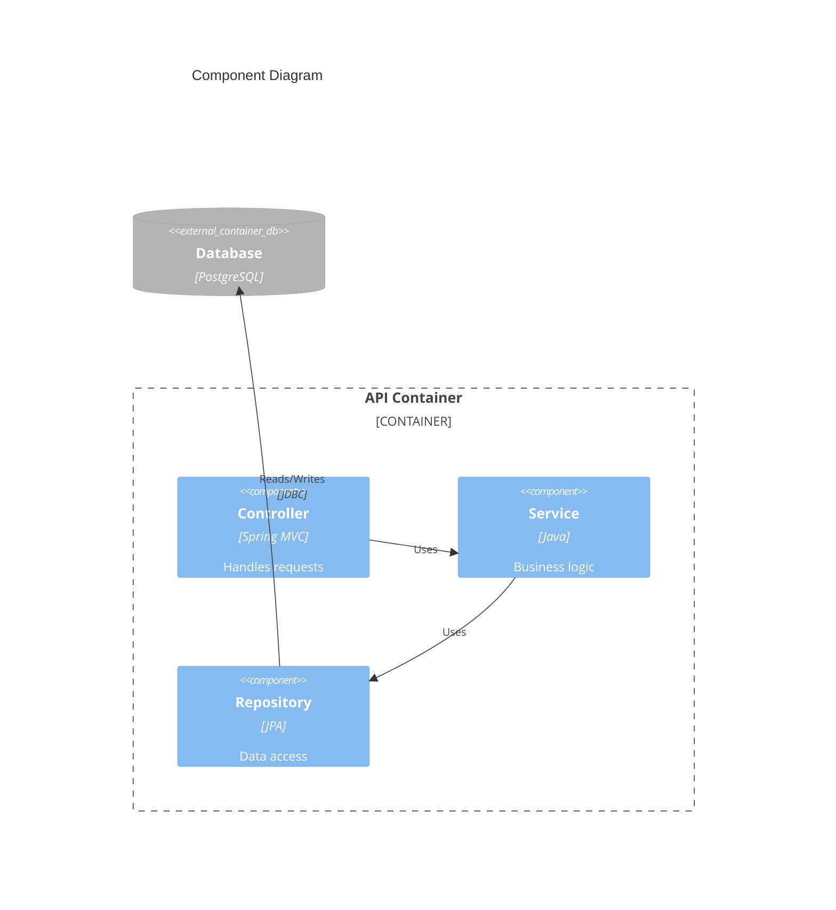

# Generate Software Diagram

Generate software diagrams in Mermaid format from text descriptions or requirement documents.

## Supported Diagram Types

- `flowchart` - Process flows and decision trees
- `sequence` - Interaction/sequence diagrams
- `class` - UML class diagrams
- `er` - Entity-relationship diagrams
- `gantt` - Project timeline/Gantt charts
- `c4-context` - C4 system context diagram
- `c4-container` - C4 container diagram
- `c4-component` - C4 component diagram

## CRITICAL: Mermaid Syntax Rules

**You MUST follow these syntax rules to prevent diagram generation errors:**

### Reserved Words and Keywords

1. **The word "end" MUST be capitalized** or avoided entirely
   - ✅ CORRECT: `End([End])` or `Finish([Finish])`
   - ❌ INCORRECT: `end([end])` - Will break the parser
   - This applies to flowcharts, subgraphs, loops, and alt blocks

2. **Avoid "o" and "x" as first characters** in node IDs
   - ❌ INCORRECT: `dev—ops[DevOps]` creates circle edge
   - ✅ CORRECT: `dev—Ops[DevOps]` or `dev— ops[DevOps]`

### Special Characters and Escaping

3. **Always wrap text with special characters in double quotes**
   - Use HTML entity codes for special characters inside quotes:
     - `#quot;` for double quotes (")
     - `#35;` for hash (#)
     - `#40;` for opening parenthesis (
     - `#41;` for closing parenthesis )
   - ✅ CORRECT: `A["User inputs #quot;password#quot;"]`
   - ❌ INCORRECT: `A[User inputs "password"]`

4. **Participant names with spaces require quotes and aliases**
   - ✅ CORRECT: `participant API as "API Server"`
   - ❌ INCORRECT: `participant API Server`
   - Use aliases for cleaner diagram code: `participant U as User`

### Version Requirements

5. **Minimum Mermaid version: v10.7.0+**
   - Some features require v11.0.0+ (will be noted in examples)
   - C4 diagrams are EXPERIMENTAL and syntax may change

### Validation Before Output

6. **Always validate syntax before outputting**
   - Check for lowercase "end" keywords
   - Verify all special characters are escaped
   - Ensure participant names are properly quoted
   - Confirm proper spacing and formatting

## Arguments

The command receives these arguments:
- `$1` - Diagram type (one of the types listed above)
- `$2` - Description text OR path to file containing requirements
- `$3` and `$4` - Optional: `--save` flag followed by output file path

## Instructions

Follow these steps to generate the diagram:

### Step 1: Parse Arguments

1. Extract diagram type from `$1`
2. Validate it's one of the supported types
3. If invalid, show error with list of valid types

### Step 2: Get Content

1. Check if `$2` starts with `/`, `./`, or `../` (indicates file path)
2. **If file path**: Use the Read tool to load the file content
3. **If not a file path**: Use `$2` directly as the description text
4. If file read fails, show error message

### Step 3: Generate Mermaid Diagram

Based on the diagram type, generate appropriate Mermaid syntax:

#### Flowchart


#### Sequence Diagram


**Key Syntax Rules for Sequence Diagrams:**
- Use `participant X as "Name"` for aliases (required for names with spaces)
- Arrow types: `->>` solid, `-->>` dotted, `-x` sync call, `--x` async return
- Activation: `+` suffix to activate, `-` suffix to deactivate (e.g., `->>+API`)
- Notes: `Note over A,B: Text` or `Note right of A: Text`
- Loops: `loop` ... `end` (capitalize "end"!)
- Conditionals: `alt` ... `else` ... `end`

#### Class Diagram
```mermaid
classDiagram
    class User {
        +string name
        +string email
        -string password
        +login(username: string, password: string): boolean
        +logout(): void
    }
    class Admin {
        +manageUsers(): void
    }
    class <<interface>> IAuthenticatable {
        +authenticate(): boolean
    }

    User --|> IAuthenticatable : implements
    Admin --|> User : inherits
    User --* Session : composition
    User --o Role : aggregation
```

**Key Syntax Rules for Class Diagrams:**
- Attributes: `+type name` (no parentheses)
- Methods: `+methodName(): returnType` (parentheses required)
- Visibility: `+` public, `-` private, `#` protected, `~` package
- Annotations: `<<interface>>`, `<<abstract>>`, `<<enumeration>>`
- Relationships:
  - `--|>` inheritance
  - `--*` composition (filled diamond)
  - `--o` aggregation (hollow diamond)
  - `-->` association
  - `..>` dependency
  - `...|>` realization
- Cardinality: Add `"1" Class1 --> "many" Class2` for multiplicity

#### ER Diagram


**Key Syntax Rules for ER Diagrams:**
- Entity names with spaces: Use quotes `"LINE ITEM"`
- Attributes format: `type name` optionally followed by `PK`, `FK`, `UK`
- Cardinality symbols (left to right):
  - `||--||` one to one
  - `||--o{` one to zero or more
  - `||--|{` one to one or more
  - `}o--o{` zero or more to zero or more
  - `}|--|{` one or more to one or more
- Relationship labels: `ENTITY1 ||--o{ ENTITY2 : "relationship name"`
- Use solid lines for identifying relationships, dotted `..` for non-identifying (optional)

#### Gantt Chart


**Key Syntax Rules for Gantt Charts:**
- Format: `Task name :status, id, start, duration`
- Status options: `active`, `done`, `crit` (critical), `milestone`
- Start can be: absolute date or `after taskId`
- Duration: `Xd` (days), `Xw` (weeks)
- Must declare `dateFormat` before tasks
- Section headers: `section Section Name`
- Task dependencies: Reference by task ID (e.g., `after design`)

#### C4 Context Diagram

**⚠️ WARNING: C4 diagrams are EXPERIMENTAL. Syntax may change in future Mermaid versions.**



**C4 Context Syntax:**
- `Person(id, "label", "description")`
- `System(id, "label", "description")` - internal systems
- `System_Ext(id, "label", "description")` - external systems
- `Rel(from, to, "label")` or `Rel(from, to, "label", "technology")`
- Use `Enterprise_Boundary(id, "label")` for multi-system contexts

#### C4 Container Diagram


**C4 Container Syntax:**
- `Container(id, "label", "technology", "description")`
- `ContainerDb(id, "label", "technology", "description")` - databases
- `Container_Boundary(id, "label")` - groups containers within a system
- Use `Container_Boundary` (not `System_Boundary`) in container diagrams
- External containers: `Container_Ext(id, "label", "tech", "desc")`

#### C4 Component Diagram


**C4 Component Syntax:**
- `Component(id, "label", "technology", "description")`
- `Container_Boundary(id, "label")` - groups components within a container
- External components: `Component_Ext(id, "label", "tech", "desc")`
- External containers: `ContainerDb_Ext(id, "label", "technology")`
- **Note:** Do NOT use `System_Boundary` in component diagrams

### Guidelines for Diagram Generation

1. **Analyze the content** thoroughly to understand the requirements
2. **Extract key entities, processes, or components** from the description
3. **Use clear, descriptive labels** for all elements
4. **Follow Mermaid syntax exactly** - proper indentation and formatting
5. **Add meaningful relationships** and interactions
6. **Include comments** in the diagram code to explain sections
7. **Keep diagrams focused** - don't overcrowd with too many elements
8. **Use proper node types** (rectangles, diamonds, circles) as appropriate

### IMPORTANT: Layout and Readability

**The layout and visual presentation of diagrams is critical for readability when rendered as images.**

1. **Direction matters**:
   - Flowcharts: Use `TD` (top-down) or `LR` (left-right) based on content flow
   - Sequence: Arrange participants logically (user first, external systems last)
   - Class: Group related classes together, minimize line crossings

2. **Spacing and organization**:
   - Leave visual space between unrelated elements
   - Group related components within boundaries (for C4 diagrams)
   - Arrange elements to minimize crossing lines
   - Order elements logically (e.g., architectural layers top to bottom)

3. **Hierarchy and flow**:
   - High-level concepts at top, details below
   - Input/trigger on left, output/result on right
   - Main path should be visually clear
   - Alternative paths should branch clearly

4. **Readability optimization**:
   - Limit to 5-15 main elements per diagram
   - Use subgraphs/boundaries to organize complex diagrams
   - Consider splitting very complex diagrams into multiple focused diagrams
   - Test that all text labels are readable at standard zoom levels

### Step 4: Output the Diagram

1. Check if `$3` is `--save` and `$4` contains a file path
2. **If --save flag present**:
   - Use the Write tool to save the diagram to the specified path
   - Wrap diagram in markdown code block with `mermaid` language tag
   - Show success message: "Diagram saved to {path}"
3. **If no --save flag**:
   - Display the diagram in a markdown code block
   - Add usage note: "Copy this diagram code to use in your documentation"

### Output Format

Always output diagrams in this format:

````markdown
```mermaid
[diagram code here]
```
````

### Error Handling

- If diagram type is invalid: List valid types and ask user to retry
- If file path doesn't exist: Show error and ask for correct path
- If content is insufficient: Ask user to provide more details
- If unable to generate: Explain what information is missing

## Examples

**Example 1: Inline description**
```bash
/common-engineering:generate-diagram sequence "User login: user submits credentials, server validates, returns JWT token"
```

**Example 2: From requirements file**
```bash
/common-engineering:generate-diagram c4-context ./docs/requirements.md
```

**Example 3: Save to file**
```bash
/common-engineering:generate-diagram flowchart ./docs/process.md --save docs/diagrams/process-flow.md
```

## Best Practices

- For complex systems, start with C4 context, then drill down to container/component
- Sequence diagrams work best with 3-7 participants
- Class diagrams should show key relationships, not every property
- ER diagrams should include cardinality (||--o{, ||--|{, etc.)
- Gantt charts: use realistic date formats and dependencies
- Flowcharts: use consistent shape meanings (diamond for decisions, etc.)
