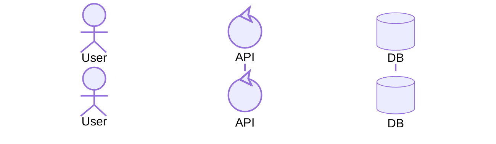
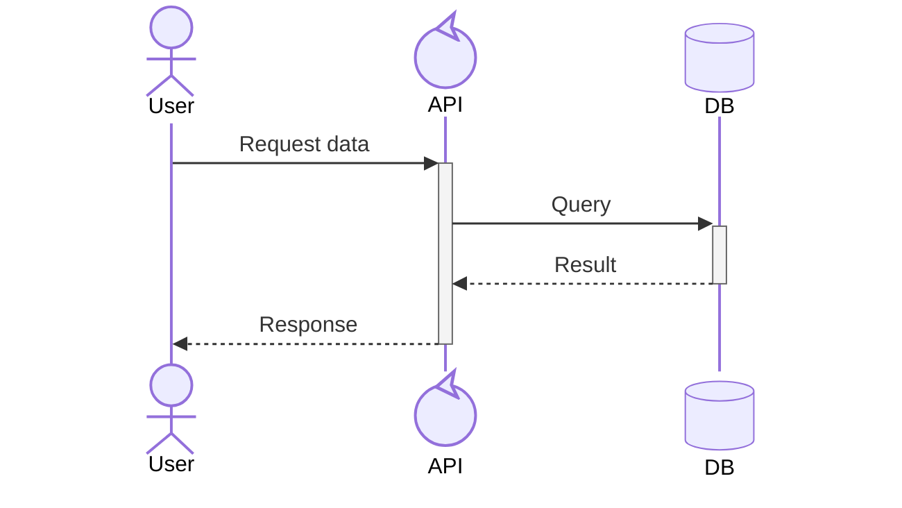
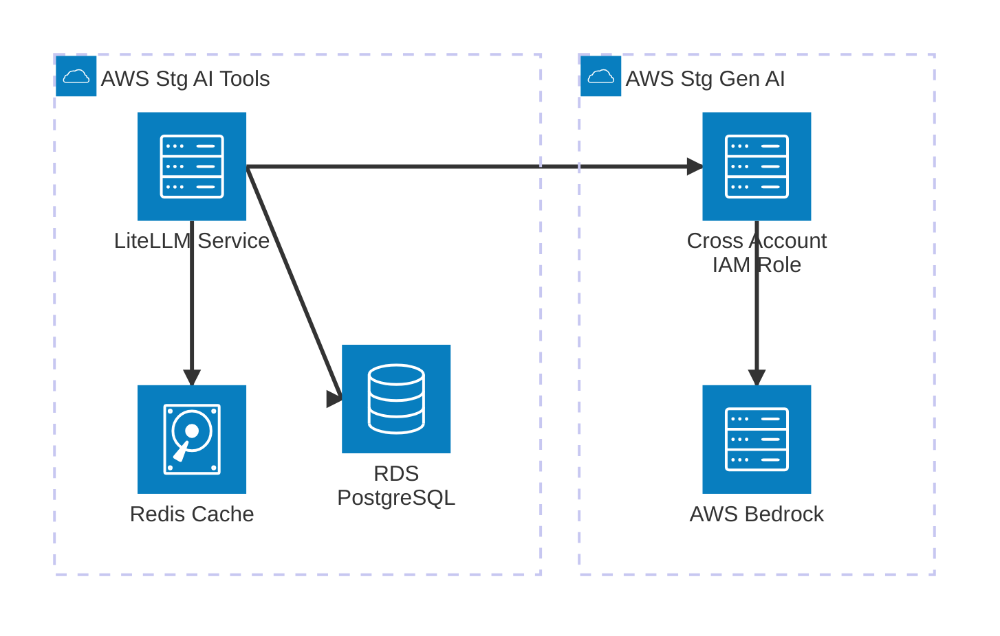

# Mermaid Diagrams

Create professional diagrams using Mermaid syntax for documentation, design discussions, and system architecture planning. This skill covers two primary diagram types:

- **Sequence Diagrams**: Show temporal interactions and message flows between actors, services, or processes
- **Architecture Diagrams**: Visualize relationships between services and resources in cloud or CI/CD deployments

## 🚀 Automatic Validation Workflow

**IMPORTANT**: All diagrams generated by this skill are automatically validated with mermaid-cli. This ensures error-free diagrams that render correctly every time.

### Mandatory Workflow Steps

When creating diagrams, ALWAYS follow this exact workflow:

1. **Generate Diagram Content** (based on user requirements)
2. **AUTOMATICALLY VALIDATE** using mermaid-cli (mandatory step)
3. **APPLY SELF-HEALING FIXES** if validation fails (automatic)
4. **CONFIRM VALIDATION SUCCESS** before presenting to user
5. **DELIVER VALIDATED DIAGRAM** to user

**NEVER skip validation or present unvalidated diagrams to users.**

## Sequence Diagrams

Sequence diagrams are interaction diagrams that show how processes operate with one another and in what order. They visualize temporal interactions between participants, making them ideal for documenting API flows, system integrations, user interactions, and distributed system communications.

### Quick Instructions

1. Define participants: Use `actor` (humans) or `participant` with type attributes
2. Add messages: `->>` (sync), `-->>` (response), `-)` (async)
3. Show activations: Append `+`/`-` to arrows (`A->>+B`, `B-->>-A`)
4. Control structures: `alt`/`else`, `loop`, `par`, `critical` for complex flows

**→ For detailed syntax, see [sequence-diagrams-reference.md](sequence-diagrams-reference.md)**

### 🔍 Automatic Validation Process

After generating any sequence diagram, you MUST:

1. **Create temp file:**
   ```bash
   echo "YOUR_SEQUENCE_DIAGRAM_HERE" > /tmp/mermaid_validate.mmd
   ```

2. **Run validation:**
   ```bash
   mmdc -i /tmp/mermaid_validate.mmd -o /tmp/mermaid_validate.svg -q 2>&1; echo $?
   ```

3. **If validation fails, apply fixes:**
   - Check participant syntax: ensure `participant` or `actor` keywords used correctly
   - Verify arrow syntax: `->>`, `-->>`, `-)` patterns are correct
   - Validate control structures: `alt`, `loop`, `par` blocks are properly closed

4. **Re-validate until successful:**
   ```bash
   mmdc -i /tmp/mermaid_validate.mmd -o /tmp/mermaid_validate.svg -q 2>&1; echo $?
   ```

5. **Cleanup and confirm:**
   ```bash
   rm -f /tmp/mermaid_validate.mmd /tmp/mermaid_validate.svg
   ```

**VALIDATION MUST PASS BEFORE PRESENTING TO USER!**

### ⚠️ CRITICAL: Key Syntax Differences

**NEVER MIX THESE SYNTAXES!** Each diagram type has completely different keywords. Mixing them will break your diagram.

**Sequence Diagrams:**

- Use `actor` for humans (stick figure icon)
- Use `participant` with type attributes for systems
- ✓ Use: `participant`, `actor`
- ✗ NEVER use: `service`, `database`, `group`

**Architecture Diagrams:**

- Use `service` for components
- Use `database` as a keyword (NOT participant!)
- Use `group` for organizing services
- ✓ Use: `service`, `database`, `group`
- ✗ NEVER use: `participant`, `actor`

### Minimal Example



### Guidelines

- Limit to 5-7 participants per diagram for clarity
- Use activations (`+`/`-`) to show processing periods
- Apply control structures (`alt`, `loop`, `par`) for complex flows

**→ See [sequence-diagrams-reference.md](sequence-diagrams-reference.md) for detailed patterns and best practices**

---

## Architecture Diagrams

Architecture diagrams show relationships between services and resources commonly found within cloud or CI/CD deployments. Services (nodes) are connected by edges, and related services can be placed within groups to illustrate organization.

### Quick Instructions

1. Start with `architecture-beta` keyword
2. Define groups: `group {id}({icon})[{label}]`
3. Add services: `service {id}({icon})[{label}] in {group}`
4. Connect edges: `{id}:{T|B|L|R} -- {T|B|L|R}:{id}`
5. Add arrows: `-->` (single) or `<-->` (bidirectional)

**CRITICAL Syntax Rules:**
- **IDs**: Use simple alphanumeric (e.g., `api`, `db1`, `auth_service`) - NO spaces or special chars
- **Labels**: AVOID special characters that break parsing:
  - ❌ NO hyphens (`Gen-AI`, `Cross-Account`)
  - ❌ NO colons (`AWS Account: prod`)
  - ❌ NO special punctuation
  - ✓ Use spaces: `[Gen AI]` instead of `[Gen-AI]`
  - ✓ Use simple words: `[Cross Account IAM Role]` instead of `[Cross-Account IAM Role]`

**Default icons**: `cloud`, `database`, `disk`, `internet`, `server`

**→ For extended icons and advanced features, see [architecture-diagram-reference.md](architecture-diagram-reference.md)**

### 🔍 Automatic Validation Process

After generating any architecture diagram, you MUST:

1. **Create temp file:**
   ```bash
   echo "YOUR_ARCHITECTURE_DIAGRAM_HERE" > /tmp/mermaid_validate.mmd
   ```

2. **Run validation:**
   ```bash
   mmdc -i /tmp/mermaid_validate.mmd -o /tmp/mermaid_validate.svg -q 2>&1; echo $?
   ```

3. **If validation fails, apply automatic fixes:**
   - **Fix hyphens in labels**: `[Gen-AI]` → `[Gen AI]`
   - **Remove colons**: `[API:prod]` → `[API Prod]`
   - **Remove special characters**: keep only alphanumeric, spaces, underscores
   - **Fix IDs**: ensure no spaces in service/group IDs (use underscores)

4. **Re-validate until successful:**
   ```bash
   mmdc -i /tmp/mermaid_validate.mmd -o /tmp/mermaid_validate.svg -q 2>&1; echo $?
   ```

5. **Cleanup and confirm:**
   ```bash
   rm -f /tmp/mermaid_validate.mmd /tmp/mermaid_validate.svg
   ```

**VALIDATION MUST PASS BEFORE PRESENTING TO USER!**

### Minimal Example



**Note**: No hyphens in labels! Use spaces instead (`Gen AI` not `Gen-AI`)

### Guidelines

- Group related services with `group` declarations
- Use clear directional indicators (T/B/L/R) and arrows (`-->`)
- Limit to 8-12 services per diagram for clarity

**→ See [architecture-diagram-reference.md](architecture-diagram-reference.md) for icons, junctions, and complex patterns**

---

## When to Use Each Diagram Type

### Use Sequence Diagrams When:
- Documenting **temporal interactions** and message ordering
- Showing **API request/response flows**
- Illustrating **authentication or authorization flows**
- Explaining **microservices communication patterns**
- Demonstrating **error handling** and conditional logic
- Visualizing **actor interactions** over time

### Use Architecture Diagrams When:
- Showing **infrastructure relationships** and deployment structure
- Documenting **cloud service architecture**
- Illustrating **CI/CD pipeline components**
- Visualizing **system topology** and service organization
- Explaining **resource dependencies** (databases, storage, networks)
- Presenting **high-level system design**

---

## Common Best Practices

**For Both Diagram Types:**

1. **Start simple**: Begin with basic structures, then add complexity as needed
2. **Use consistent naming**: Follow your project's naming conventions
3. **Keep it focused**: If a diagram becomes unclear, split it into multiple diagrams
4. **Test readability**: Ensure diagrams are readable at typical documentation sizes
5. **Version control**: Treat diagrams as code—review changes and maintain them alongside implementation
6. **Document assumptions**: Use notes or descriptions to clarify business rules or technical constraints

**Diagram Size Guidelines:**
- **Sequence**: Limit to 5-7 participants per diagram
- **Architecture**: Limit to 8-12 services per diagram
- For larger systems, create multiple diagrams focusing on specific subsystems or layers

**When Diagrams Conflict:**
- For **runtime behavior** → use sequence diagrams
- For **deployment structure** → use architecture diagrams
- For complex systems, use both: architecture for overview, sequence for interactions

---

## Common Mistakes

### ❌ Common Syntax Mistakes

**Architecture diagrams**: NEVER use these patterns:

1. **Hyphens in labels** (breaks parsing):
   - ❌ `[Gen-AI]`, `[Cross-Account]`, `[AI-Tools]`
   - ✓ `[Gen AI]`, `[Cross Account]`, `[AI Tools]`

2. **Special characters in labels**:
   - ❌ `[AWS Account: prod]` (colons)
   - ❌ `[DB@prod]` (at symbols)
   - ✓ `[AWS Account Prod]` (simple words)

3. **Invalid keywords in sequence diagrams**:
   - ❌ `database DB`, `service API`
   - ✓ `participant DB@{ "type": "database" }`

**→ See examples above for correct syntax patterns**

**🔧 Validation Tip**: These errors are automatically caught and fixed by the mandatory validation process. See the [Automatic Validation Workflow](#-automatic-validation-workflow) section.

---

## Troubleshooting

**Sequence Diagrams:**
- **"end" keyword breaks diagram**: Wrap in quotes `"end"` or parentheses `(end)`
- **Participant not appearing**: Explicitly declare with `participant Name` before first use
- **Arrow not rendering**: Verify syntax (`->>`, `-->>`, `->`, `-->`, `-)`)

**Architecture Diagrams:**
- **Parsing errors with labels**: Avoid colons (`:`) and complex punctuation in labels
  - ❌ Wrong: `[AWS Account: prod api]`
  - ✓ Correct: `[AWS Account Prod API]`
- **Invalid ID errors**: Use simple alphanumeric IDs without spaces
  - ❌ Wrong: `group stg ai-tools` (space in ID)
  - ✓ Correct: `group stg_aitools` or `group aitools_stg`
- **Service not in group**: Ensure group is declared before service, use `in {group_id}`
- **Edge not connecting**: Verify both services exist and direction indicators are valid (T/B/L/R)
- **Icon not displaying**: Check icon name spelling or use default icons

**Validation & mmdc Issues:**
- **mmdc not found**: Install mermaid-cli with `npm install -g @mermaid-js/mermaid-cli`
- **Permission errors**: Check write permissions to `/tmp` directory
- **Silent failures**: Run validation with verbose output to see detailed errors
- **Persistent syntax errors**: Use the [Automatic Validation Workflow](#-automatic-validation-workflow) to automatically detect and fix common issues

---

## Reference Documentation

For complete syntax, advanced features, and more examples:

- **[sequence-diagrams-reference.md](sequence-diagrams-reference.md)** - All arrow types, activations, control structures, styling, and configuration
- **[architecture-diagram-reference.md](architecture-diagram-reference.md)** - Complete syntax, junctions, extended icons (200k+ from iconify), and complex patterns

---

This skill enables you to create professional diagrams for documentation, design discussions, API specifications, and system architecture planning. Choose the appropriate diagram type based on whether you're documenting temporal interactions (sequence) or structural relationships (architecture).
