# Flowchart Diagram Reference

Comprehensive syntax reference for creating flowchart diagrams in Mermaid. Flowcharts consist of **nodes** (geometric shapes) and **edges** (connecting lines/arrows) that visualize processes, decision logic, algorithms, and workflows.

## Basic Syntax

All flowcharts start with the `flowchart` keyword followed by an optional direction:

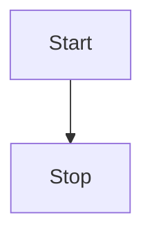

## Direction Control

Control the orientation of your flowchart:

| Direction | Description |
|-----------|-------------|
| `TB` or `TD` | Top to Bottom (default) |
| `BT` | Bottom to Top |
| `LR` | Left to Right |
| `RL` | Right to Left |

**Example:**


---

## Node Shapes

### Basic Node Types

#### Default Node (Rectangle with Text)
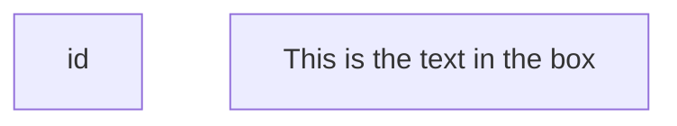

#### Round Edges (Rounded Rectangle)
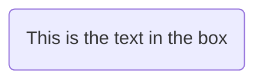

#### Stadium Shape (Pill Shape)
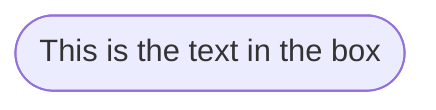

#### Subroutine (Rectangle with Vertical Lines)
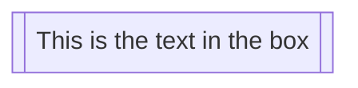

#### Cylinder (Database)
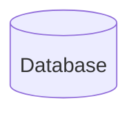

#### Circle
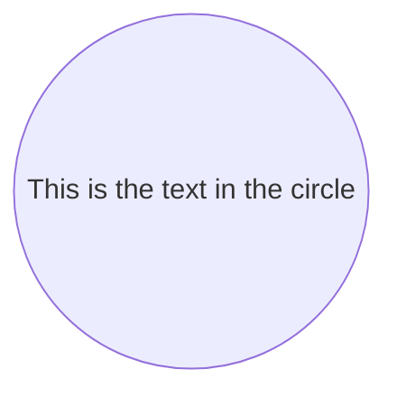

#### Double Circle
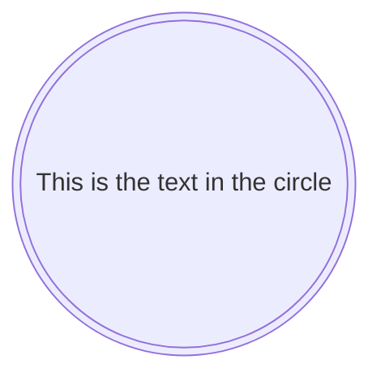

#### Asymmetric Shape
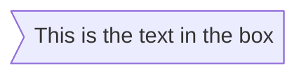

#### Diamond/Rhombus (Decision)
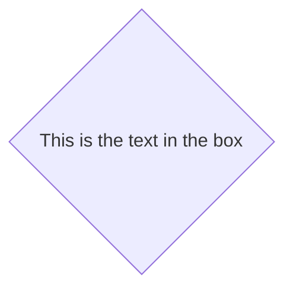

#### Hexagon
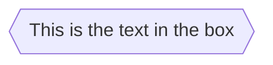

#### Parallelogram (Input/Output)
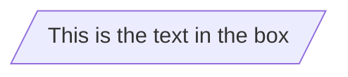

#### Parallelogram Alt
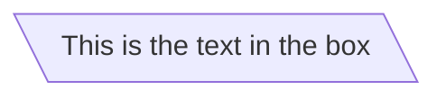

#### Trapezoid
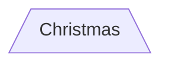

#### Trapezoid Alt
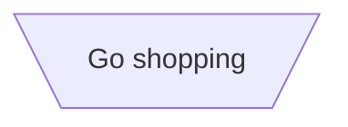

### Node Shape Quick Reference Table

| Shape | Syntax | Common Use |
|-------|--------|------------|
| Rectangle | `id[Text]` | Process/Action |
| Round edges | `id(Text)` | Start/End |
| Stadium | `id([Text])` | Start/End (alternate) |
| Subroutine | `id[[Text]]` | Predefined process |
| Cylinder | `id[(Text)]` | Database |
| Circle | `id((Text))` | Connection point |
| Double circle | `id(((Text)))` | Special endpoint |
| Diamond | `id{Text}` | Decision/Condition |
| Hexagon | `id{{Text}}` | Preparation |
| Parallelogram | `id[/Text/]` | Input/Output |
| Trapezoid | `id[/Text\]` | Manual operation |

---

## Text Formatting

### Unicode Support
Use quotes for Unicode characters:
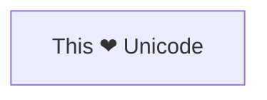

### Markdown in Nodes
Use backticks with double quotes for markdown formatting:
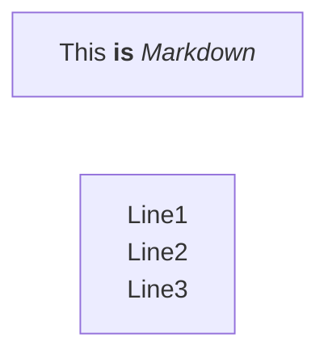

Supports:
- **Bold**: `**text**`
- *Italics*: `*text*`
- Line breaks (automatic wrapping)

---

## Edges/Links

### Basic Link Types

#### Standard Arrow


#### Open Link (No Arrow)
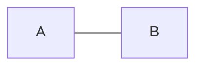

#### Text on Link
```mermaid
flowchart LR
    A-- This is the text! ---B
    C---|This is the text|D
```

#### Arrow with Text
```mermaid
flowchart LR
    A-->|text|B
    C-- text -->D
```

#### Dotted Link
```mermaid
flowchart LR
    A-.->B
```

#### Dotted Link with Text
```mermaid
flowchart LR
    A-. text .-> B
```

#### Thick Link
```mermaid
flowchart LR
    A ==> B
```

#### Thick Link with Text
```mermaid
flowchart LR
    A == text ==> B
```

#### Invisible Link (for spacing)
```mermaid
flowchart LR
    A ~~~ B
```

### Special Edge Types

#### Circle Edge
```mermaid
flowchart LR
    A --o B
```

#### Cross Edge
```mermaid
flowchart LR
    A --x B
```

### Multi-directional Arrows

```mermaid
flowchart LR
    A o--o B
    B <--> C
    C x--x D
```

### Edge Types Quick Reference

| Type | Syntax | Description |
|------|--------|-------------|
| Standard arrow | `A-->B` | Directional flow |
| Open link | `A---B` | Connection without direction |
| Arrow with text | `A-->|text|B` | Labeled flow |
| Dotted arrow | `A-.->B` | Optional/alternative path |
| Thick arrow | `A==>B` | Emphasized flow |
| Invisible link | `A~~~B` | Hidden connection (spacing) |
| Circle edge | `A--oB` | Special connection |
| Cross edge | `A--xB` | Terminated/blocked flow |
| Bidirectional | `A<-->B` | Two-way flow |

---

## Link Length Control

Control the visual length of connections by adding extra dashes or dots:

| Length Type | 1 | 2 | 3 |
|---|---|---|---|
| Normal | `---` | `----` | `-----` |
| With arrow | `-->` | `--->` | `---->` |
| Thick | `===` | `====` | `=====` |
| Thick arrow | `==>` | `===>` | `====>` |
| Dotted | `-.-` | `-..-` | `-...-` |
| Dotted arrow | `-.->` | `-..->` | `-...->` |

**Example:**
```mermaid
flowchart TD
    A --> B
    A ---> C
    A -----> D
```

---

## Chaining Links

### Sequential Chaining
Connect multiple nodes in one line:
```mermaid
flowchart LR
    A -- text --> B -- text2 --> C
```

### Parallel Connections with Ampersand
Connect multiple nodes to multiple targets:
```mermaid
flowchart TD
    a --> b & c --> d
```

Multiple sources to multiple targets:
```mermaid
flowchart TD
    A & B --> C & D
```

---

## Subgraphs

Group related nodes together using subgraphs.

### Basic Subgraph
```mermaid
flowchart TB
    c1-->a2
    subgraph one
        a1-->a2
    end
    subgraph two
        b1-->b2
    end
    subgraph three
        c1-->c2
    end
```

### Subgraph with Explicit ID
```mermaid
flowchart TB
    subgraph ide1 [one]
        a1-->a2
    end
```

### Nested Subgraphs
```mermaid
flowchart TB
    subgraph TOP
        direction TB
        subgraph B1
            direction RL
            i1 -->f1
        end
        subgraph B2
            direction BT
            i2 -->f2
        end
    end
    A --> TOP --> B
```

### Direction in Subgraphs
```mermaid
flowchart LR
    subgraph TOP
        direction TB
        subgraph B1
            direction RL
            i1 -->f1
        end
    end
```

**Note:** External node links can override subgraph direction settings.

---

## Styling

### Link Styling

Apply styles to specific links by their order (zero-indexed):

```mermaid
flowchart LR
    A-->B
    B-->C
    C-->D
    D-->E
    linkStyle 0 stroke:#ff3,stroke-width:4px,color:red;
    linkStyle 3 stroke:#00f,stroke-width:2px;
```

Style multiple links at once:
```mermaid
flowchart LR
    A-->B
    B-->C
    C-->D
    linkStyle 0,1,2 color:blue;
```

### Node Styling

Apply inline styles to specific nodes:

```mermaid
flowchart LR
    id1(Start)-->id2(Stop)
    style id1 fill:#f9f,stroke:#333,stroke-width:4px
    style id2 fill:#bbf,stroke:#f66,stroke-width:2px,color:#fff,stroke-dasharray: 5 5
```

**Available style properties:**
- `fill`: Background color
- `stroke`: Border color
- `stroke-width`: Border width
- `color`: Text color
- `stroke-dasharray`: Dashed border pattern

### Classes

Define reusable style classes:

```mermaid
flowchart LR
    A:::someclass --> B
    classDef someclass fill:#f96
```

Apply class to multiple nodes:
```mermaid
flowchart LR
    A-->B[AAA<span>BBB</span>]
    B-->D
    class A cssClass
```

**Class definition syntax:**
```mermaid
flowchart TD
    A[Start] --> B[Process]
    classDef green fill:#9f6,stroke:#333,stroke-width:2px;
    classDef orange fill:#f96,stroke:#333,stroke-width:4px;
    class A green
    class B orange
```

### Default Class

Apply styles to all nodes without specific styling:

```mermaid
flowchart TD
    A[Start] --> B{Decision}
    B -->|Yes| C[OK]
    B -->|No| D[Not OK]
    classDef default fill:#f9f,stroke:#333,stroke-width:2px;
```

### CSS Classes

Reference predefined CSS classes from your HTML/stylesheet:

```html
<style>
    .cssClass > rect {
        fill:#FF0000;
        stroke:#FFFF00;
        stroke-width:4px;
    }
</style>
```

```mermaid
flowchart LR
    A-->B[AAA<span>BBB</span>]
    B-->D
    class A cssClass
```

---

## Curve Styles

Control the curve interpolation of edges at the diagram level:

```mermaid
---
config:
  flowchart:
    curve: stepBefore
---
flowchart LR
    A --> B --> C
```

**Available curve types:**
- `basis`
- `bumpX`
- `bumpY`
- `cardinal`
- `catmullRom`
- `linear` (default)
- `monotoneX`
- `monotoneY`
- `natural`
- `step`
- `stepAfter`
- `stepBefore`

---

## Advanced Features

### Edge IDs and Animation

Assign IDs to edges and apply animations:

```mermaid
flowchart LR
    A e1@--> B
    e1@{ animate: true }
```

**Animation speeds:**
- `fast`
- `slow`

### Icons in Nodes

Add FontAwesome icons to nodes:

```mermaid
flowchart TD
    A@{ icon: "fa:user", form: "square", label: "User Icon", pos: "t", h: 60 }
    B@{ icon: "fa:database", form: "circle", label: "Database", pos: "b" }
```

**Icon parameters:**
- `icon`: Icon identifier (e.g., `"fa:user"`)
- `form`: Shape - `square`, `circle`, `rounded`
- `label`: Text label
- `pos`: Position - `t` (top), `b` (bottom)
- `h`: Height in pixels
- `w`: Width in pixels

### Images in Nodes

Embed images in nodes:

```mermaid
flowchart LR
    A@{ img: "https://example.com/image.png", label: "Label", w: 60, h: 60, constraint: "on" }
```

**Image parameters:**
- `img`: Image URL
- `label`: Text label
- `w`: Width in pixels
- `h`: Height in pixels
- `constraint`: Layout constraint (`"on"` or `"off"`)

---

## Interactions

### Click Events

Add clickable elements to nodes:

#### Callback Function
```mermaid
flowchart LR
    A-->B
    click A callback "Tooltip for A"
```

```javascript
const callback = function() {
    alert('A callback was triggered');
}
```

#### External Link
```mermaid
flowchart LR
    A-->B
    click A "https://www.github.com" "Navigate to GitHub"
```

#### Function Call
```mermaid
flowchart LR
    A-->B
    click A call callback() "Tooltip"
```

### Link Targets

Specify how links open:

```mermaid
flowchart LR
    A-->B
    click A "https://www.github.com" _blank
```

**Target options:**
- `_self` - Same frame (default)
- `_blank` - New window/tab
- `_parent` - Parent frame
- `_top` - Full window

**Security Note:** Click interactions are disabled with `securityLevel='strict'` and enabled with `securityLevel='loose'`.

---

## Special Characters and Escaping

### Using Quotes

Wrap text containing special characters in quotes:

```mermaid
flowchart LR
    id1["This is the (text) in the box"]
```

Characters that need escaping: `()`, `{}`, `[]`, `:`, `;`, `|`

### Entity Codes

Use HTML entity codes for special characters:

```mermaid
flowchart LR
    A["A double quote:#quot;"] --> B["A dec char:#9829;"]
```

**Common entity codes:**
- `#quot;` - `"`
- `#35;` - `#`
- `#9829;` - ❤
- `#amp;` - `&`
- `#lt;` - `<`
- `#gt;` - `>`

---

## FontAwesome Icons

Embed FontAwesome icons in node text:

### Basic Syntax
```mermaid
flowchart TD
    B["fa:fa-twitter for peace"]
    B-->C[fa:fa-ban forbidden]
    B-->D(fa:fa-spinner)
    B-->E(A fa:fa-camera-retro perhaps?)
```

### Icon Prefixes
- `fa` - Standard icons
- `fab` - Brand icons
- `fas` - Solid style
- `far` - Regular style
- `fal` - Light style
- `fad` - Duotone style
- `fak` - Custom uploaded icons

### Required CSS
Include FontAwesome CSS in your HTML `<head>`:

```html
<link href="https://cdnjs.cloudflare.com/ajax/libs/font-awesome/6.5.1/css/all.min.css" rel="stylesheet"/>
```

---

## Comments

Add comments to your flowchart code (not rendered):

```mermaid
flowchart LR
    %% This is a comment
    A -- text --> B -- text2 --> C
    %% Another comment
```

Comments must start with `%%` at the beginning of a line.

---

## Configuration

### Renderer Selection

Choose between rendering engines:

```mermaid
---
config:
  flowchart:
    defaultRenderer: "elk"
---
flowchart TD
    A --> B
```

**Available renderers:**
- `dagre` (default) - Fast, suitable for most diagrams
- `elk` - Better for large/complex diagrams

### Width Adjustment

Control diagram width programmatically:

```javascript
mermaid.flowchartConfig = {
    width: "100%"
}
```

### Markdown Auto-Wrap

Disable automatic text wrapping in markdown strings:

```mermaid
---
config:
  markdownAutoWrap: false
---
flowchart LR
    a("`The **cat**
    in the hat`")
```

---

## Complete Example

Here's a comprehensive flowchart demonstrating multiple features:

```mermaid
flowchart TD
    Start([Start Process]) --> Input[/Enter Data/]
    Input --> Validate{Valid Data?}

    Validate -->|Yes| Process[Process Data]
    Validate -->|No| Error[Display Error]

    Error --> Input

    Process --> DB[(Save to Database)]
    DB --> Check{Success?}

    Check -->|Yes| Success([End Success])
    Check -->|No| Retry{Retry?}

    Retry -->|Yes| Process
    Retry -->|No| Fail([End Failure])

    style Start fill:#90EE90,stroke:#333,stroke-width:2px
    style Success fill:#90EE90,stroke:#333,stroke-width:2px
    style Fail fill:#FFB6C1,stroke:#333,stroke-width:2px
    style Error fill:#FFB6C1,stroke:#333,stroke-width:2px

    classDef decisionClass fill:#FFE4B5,stroke:#333,stroke-width:2px
    class Validate,Check,Retry decisionClass
```

---

## Common Patterns

### Decision Tree
```mermaid
flowchart TD
    A{Is it working?}
    A -->|Yes| B[Don't touch it]
    A -->|No| C{Did you touch it?}
    C -->|Yes| D[Idiot!]
    C -->|No| E{Does anyone know?}
    E -->|Yes| F[You're screwed]
    E -->|No| G[Hide it]
```

### Process Flow
```mermaid
flowchart LR
    A([Start]) --> B[Initialize]
    B --> C[Process Step 1]
    C --> D[Process Step 2]
    D --> E[Process Step 3]
    E --> F([End])
```

### Approval Workflow
```mermaid
flowchart TD
    Submit[Submit Request] --> Review{Manager Review}
    Review -->|Approved| Finance{Finance Check}
    Review -->|Rejected| Notify1[Notify Requester]
    Finance -->|Approved| Execute[Execute]
    Finance -->|Rejected| Notify2[Notify Requester]
    Execute --> Complete([Complete])
```

---

## Important Warnings

### Reserved Words
- **"end" keyword**: Capitalize it (`End`, `END`) or wrap in quotes to avoid breaking diagrams
  ```mermaid
  flowchart LR
      A --> End
  ```

- **"o" and "x" at line start**: Add spaces or capitalize to prevent creating circle/cross edges
  ```mermaid
  flowchart LR
      A --> B
      %% Not: o--> (creates circle edge)
      %% Use: O--> or add space
  ```

### Security Considerations
- Click interactions are disabled with `securityLevel='strict'`
- Enable with `securityLevel='loose'` when needed (only in trusted environments)

---

## Troubleshooting

### Common Issues

**Node not appearing:**
- Verify node ID is defined before use
- Check for typos in node references

**Arrow not rendering:**
- Verify arrow syntax (`-->`, `---`, `-.->`, `==>`)
- Ensure both nodes exist

**Text not displaying:**
- Use quotes for special characters: `["text (with parens)"]`
- Escape markdown properly with backticks

**Subgraph not grouping:**
- Ensure subgraph is declared before nodes
- Check indentation and `end` keyword placement

**Styling not applying:**
- Verify style syntax (no spaces around `:`)
- Check class names match definitions
- Ensure classDef comes before class assignment

**Validation failures:**
- Run mermaid-cli to get specific error messages
- Check for reserved words (like "end")
- Verify all node IDs are properly defined

---

## Best Practices

1. **Keep it simple**: Limit to 10-15 nodes per diagram for clarity
2. **Use consistent shapes**: Follow standard conventions (diamonds for decisions, cylinders for databases)
3. **Label edges**: Add text to arrows for clarity in complex flows
4. **Group with subgraphs**: Organize related processes
5. **Apply styling**: Use colors to highlight important paths or states
6. **Test readability**: Ensure diagram is readable at documentation sizes
7. **Comment your code**: Use `%%` comments to explain complex sections
8. **Version control**: Treat diagrams as code and track changes
9. **Split large diagrams**: Create multiple focused diagrams instead of one complex diagram
10. **Validate syntax**: Always test with mermaid-cli before committing

---

This reference covers the complete Mermaid flowchart syntax. Use it to create professional process diagrams, decision trees, algorithm visualizations, and workflow documentation.
