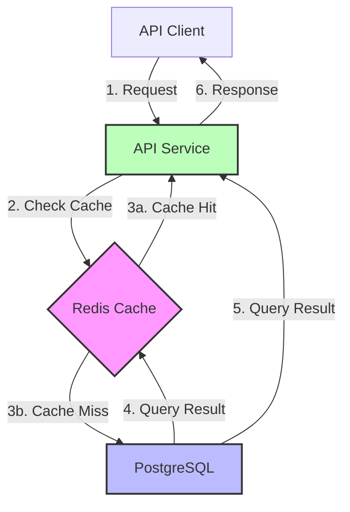

# RFC Example: Redis Caching Layer

> **Purpose**: This is a complete RFC example demonstrating how to use Universal Discovery output from Phase 1.

---

## Universal Discovery Context

Before writing this RFC, the author completed Phase 1 (Universal Discovery) with the Problem Validation Gate:

**Universal Discovery Output**:
- **Current State**: Every API request hits PostgreSQL directly. During peak hours (9AM-11AM PST), database serves 5000 req/sec.
- **Evidence**: API p95 latency increased from 100ms to 2800ms over 3 months. Support receives 20+ tickets/week about slow page loads. Database CPU at 85%+.
- **Who is Affected**: All users, especially mobile users on poor network. Enterprise sales team reports lost deals due to slow dashboard.
- **Desired State**: Frequently-accessed data served from Redis cache with 95%+ hit rate. Database queries only for cache misses or writes.
- **State Gap**: Today 100% requests hit DB. Target is <5% cache miss rate. Reduces DB load from 5000 req/s to <250 req/s.
- **Related Documents**: ADR: Cache Invalidation Strategy 2023 (previous failed attempt), TSD: API Service Architecture

This RFC uses this Universal Discovery output in the Motivation section.

---

# RFC: Add Redis Caching Layer to API Service

**Author:** Jane Smith, Backend Team Lead
**Status:** In Review
**Created:** 2024-09-10
**Last Updated:** 2024-09-15

---

## Abstract

This RFC proposes adding Redis as a caching layer between the API service and PostgreSQL to reduce database load and improve API latency. The current system queries the database on every request, causing p95 latency of 2-3 seconds during peak hours and 85%+ database CPU usage. This change will reduce latency to <200ms and decrease database load by 95%, enabling 2x throughput with current resources. Implementation affects the API service and requires Redis cluster deployment.

---

## Motivation

### Current State

**What happens now:**
Every API request to our service queries the PostgreSQL database directly. There is no caching layer. The API serves ~3000 requests/second on average, spiking to 5000 req/second during peak hours (9AM-11AM PST).

**Evidence of problem:**
- **Performance metrics**: API p95 latency increased from 100ms to 2800ms over the past 3 months (see Grafana dashboard: [API Latency Trends](https://grafana.example.com/d/api-latency))
- **User complaints**: Support team receives 20+ tickets/week about slow page loads and timeouts
- **System metrics**: Database CPU consistently at 85%+ during peak hours, causing query timeouts (avg 15 queries/hour timing out)
- **Business impact**: Enterprise sales team reports 3 lost deals in Q2 2024 (~$150K ARR) due to slow dashboard loading during demos

**Who is affected:**
- **End users**: All users experience slow page loads, especially mobile users on poor network connections (3G/4G)
- **Business teams**: Enterprise sales team cannot do effective demos due to slow dashboards
- **Internal teams**: Support team spends 10+ hours/week on performance-related tickets

### Desired State

**What should happen:**
Frequently-accessed data (user profiles, product catalogs, search results) should be served from Redis cache with a 95%+ hit rate. Database queries should only occur for cache misses or write operations. Cache should be populated lazily on first access and invalidated via TTL and write-through updates.

**The gap:**
Today, 100% of read requests hit the database. Our target is <5% cache miss rate (95%+ hit rate). This reduces database load from 5000 req/s to <250 req/s (95% reduction).

### Problem Statement

Today, every API request hits the PostgreSQL database directly, causing 2-3 second latency during peak hours and 85%+ database CPU usage. This causes mobile user churn (5% monthly churn rate, up from 3% last year) and lost enterprise deals ($150K ARR lost in Q2 2024). We need a caching layer that serves frequently-accessed data from memory. The cost of not fixing this is $50K/month in lost revenue (churn analysis) and escalating database costs (need to provision 2x DB capacity by Q4 2024 if caching not implemented).

---

## Proposed Design

### High-Level Overview

We propose adding Redis as a caching layer between the API service and PostgreSQL. The API will check Redis for cached data before querying the database. On cache hits, data is returned immediately from Redis. On cache misses, the API queries PostgreSQL, populates Redis with the result, and returns data to the client. Cache entries will expire based on TTL (Time To Live) and be updated via write-through for critical data changes.

This approach:
- Reduces database read load by 95% (from 5000 req/s to <250 req/s)
- Improves API latency from 2800ms to <200ms p95
- Eliminates the need to provision additional database capacity
- Enables 2x throughput with current resources

### Architecture Overview

**New components**: Redis cluster, cache logic in API service
**Existing components**: API service (modified), PostgreSQL (unchanged)

### Key Components

| Component | Purpose | Technology |
|-----------|---------|------------|
| API Service (modified) | Check cache before DB queries, populate cache on misses | Node.js 20, ioredis client |
| Redis Cluster | Distributed caching layer with replication | Redis 7.2, Cluster mode |
| PostgreSQL | Persistent data storage (unchanged) | PostgreSQL 15 |

### Data Flow

**Cache Hit Path** (95% of requests):
1. Client sends request to API service
2. API service checks Redis for cached data
3. Redis returns cached data
4. API service returns data to client
5. Total latency: ~50-100ms

**Cache Miss Path** (5% of requests):
1. Client sends request to API service
2. API service checks Redis for cached data
3. Redis returns cache miss
4. API service queries PostgreSQL
5. PostgreSQL returns data
6. API service populates Redis with data (TTL: 5-60 min depending on data type)
7. API service returns data to client
8. Total latency: ~150-250ms (first request), ~50-100ms (subsequent requests)

---

## Implementation Plan

### Phase 1: Redis Infrastructure

**Goals:**
- Deploy Redis cluster in production environment
- Establish monitoring and alerting
- Document Redis operations procedures

**Tasks:**
- [ ] Provision Redis cluster (6 nodes: 3 masters, 3 replicas) in production VPC
- [ ] Configure Redis persistence (RDB snapshots every 15 minutes)
- [ ] Configure Redis backups (daily snapshots to S3, 30-day retention)
- [ ] Set up Redis monitoring (CPU, memory, hit rate, eviction rate) in Grafana
- [ ] Configure alerting (Redis down, hit rate < 70%, memory > 80%)
- [ ] Document Redis operations (restart, failover, backup/restore)
- [ ] Train oncall team on Redis operations

**Owner:** Platform Team
**Estimated effort:** 2 weeks
**Dependencies:** None (can start immediately)
**Deliverables:** Operational Redis cluster, runbooks, monitoring dashboard

### Phase 2: Cache Logic Implementation

**Goals:**
- Implement cache check/populate logic in API service
- Add comprehensive unit and integration tests
- Create feature flag for cache enable/disable

**Tasks:**
- [ ] Install ioredis client in API service
- [ ] Implement cache check before DB queries
- [ ] Implement cache populate on DB queries
- [ ] Add cache invalidation for write operations (write-through)
- [ ] Add feature flag `enable_redis_cache` (default: false)
- [ ] Add comprehensive unit tests (target: 85% coverage for cache logic)
- [ ] Add integration tests (test with real Redis in staging)
- [ ] Add cache hit rate metric export

**Owner:** Backend Team
**Estimated effort:** 3 weeks
**Dependencies:** Phase 1 (Redis infrastructure)
**Deliverables:** API service with cache logic, tests, feature flag

### Phase 3: Staging Validation

**Goals:**
- Validate caching in staging environment
- Test rollback procedure
- Measure cache hit rate and performance improvements

**Tasks:**
- [ ] Deploy API service with cache logic to staging (cache disabled via feature flag)
- [ ] Enable cache for 1% of staging traffic
- [ ] Monitor metrics: cache hit rate, latency, error rate
- [ ] Gradually increase staging traffic: 10% → 50% → 100%
- [ ] Run load test (simulate 5000 req/s for 1 hour)
- [ ] Test rollback: disable cache at 100% traffic, verify baseline returns
- [ ] Document staging results

**Owner:** QA Team
**Estimated effort:** 1 week
**Dependencies:** Phase 2 (Cache logic implementation)
**Deliverables:** Staging validation results, rollback test confirmation

### Phase 4: Production Rollout

**Goals:**
- Roll out caching to production incrementally
- Monitor production metrics
- Complete rollback validation

**Tasks:**
- [ ] Deploy API service with cache logic to production (cache disabled)
- [ ] Enable cache for 1% of production traffic (feature flag)
- [ ] Monitor for 1 hour, verify metrics are healthy
- [ ] Increase to 10% traffic, monitor for 1 hour
- [ ] Increase to 50% traffic, monitor for 1 hour
- [ ] Increase to 100% traffic, monitor for 24 hours
- [ ] Document final metrics: cache hit rate, latency, DB CPU
- [ ] Postmortem template (if issues occur)

**Owner:** Backend Team + Platform Team
**Estimated effort:** 1 week (incremental rollout over 5 days)
**Dependencies:** Phase 3 (Staging validation successful)
**Deliverables:** Caching enabled in production, metrics documented

---

## Migration Strategy

### Current System Decommissioning

**What changes:**
- No existing system is being removed (this is additive)
- Current behavior: API queries DB on every request
- New behavior: API checks Redis first, queries DB on cache miss

**When:**
- Gradual rollout over 1 week (see Phase 4)
- No hard cutoff (can revert instantly via feature flag)

**Migration method:** Phased rollout with feature flags
- Feature flag `enable_redis_cache` controls cache enable/disable
- Traffic percentage controlled via gradual rollout
- Instant rollback capability (disable feature flag)

### Data Migration

**Data scope:** No data migration required. Redis cache is populated lazily on first access.

**Migration approach:**
- **Cache population**: Lazy (populate on first access)
- **Cache warmup**: Optional (can pre-warm critical data by calling APIs)
- **Rollback**: N/A (cache is ephemeral, no persistent data to rollback)

**Rollback:**
- Disable feature flag `enable_redis_cache`
- Cache is automatically ignored (no cleanup required)
- Cache data expires via TTL (no manual cleanup needed)

### Backwards Compatibility

**API compatibility:**
- No API changes (all endpoints unchanged)
- No breaking changes for clients
- Existing clients work without modification

**Grace period:**
- N/A (no API changes)

**Deprecation timeline:**
- N/A (no deprecated behavior)

---

## Rollback Plan

> **CRITICAL**: This rollback plan has been tested in staging. Rollback can be executed in <1 minute.

### Rollback Triggers

We will rollback if any of these conditions occur:

- [ ] p95 API latency increases by >50% for 5 minutes (baseline: pre-cache latency)
- [ ] API error rate exceeds 1% for 2 minutes
- [ ] Cache hit rate < 70% for 10 minutes (indicates cache isn't effective)
- [ ] Redis cluster is unavailable for >2 minutes
- [ ] Database CPU increases by >20% (indicates cache is causing issues)
- [ ] Manual trigger (oncall decision)

### Rollback Procedure

1. **Disable feature flag**: Set `enable_redis_cache=false` via LaunchDarkly (instant, <1 second)
2. **Verify baseline**: Check Grafana dashboard "API Latency" - expect latency to return to pre-cache baseline within 30 seconds
3. **Verify errors**: Check Grafana dashboard "API Error Rate" - expect error rate to return to baseline within 1 minute
4. **Confirm Redis status**: Check Grafana dashboard "Redis Metrics" - verify Redis is still healthy (may need separate investigation)
5. **Post incident note**: Create incident note explaining rollback and next steps
6. **Notify stakeholders**: Slack message to #backend-notify and #product-notify

**Total rollback time**: <1 minute for feature flag change, ~5 minutes for full verification

### Rollback Validation

**How do we confirm rollback was successful:**
- [ ] API p95 latency returns to pre-cache baseline (within 100ms of baseline)
- [ ] API error rate returns to baseline
- [ ] No increase in database errors
- [ ] No customer reports of issues (check #support and Zendesk)

**Rollback test results** (from staging, 2024-09-14):
- ✅ Disabled feature flag at 100% traffic
- ✅ Latency returned to baseline within 30 seconds
- ✅ Error rate returned to baseline within 1 minute
- ✅ No errors or spikes during rollback
- ✅ Test duration: 1 hour (cache enabled at 100%, then disabled)

---

## Testing Strategy

### Unit Tests

**Coverage target:**
- 85% for new cache logic files
- 80% overall for API service

**Key test scenarios:**
- [ ] Cache hit returns cached data without DB query
- [ ] Cache miss queries DB and populates cache
- [ ] Cache populate sets correct TTL
- [ ] Cache populate handles Redis errors (fallback to DB)
- [ ] Write-through updates cache on data changes
- [ ] Feature flag false skips cache logic
- [ ] Cache key generation is consistent
- [ ] Cache serialization/deserialization handles all data types

**Test environment:**
- Jest test runner
- Mock Redis client (use ioredis-mock)
- Mock database queries

### Integration Tests

**What's tested:**
- Cache hit/miss scenarios with real Redis
- Cache invalidation on write operations
- Feature flag enable/disable
- Redis failure scenarios (cache unavailable)

**Test environment:**
- Staging environment with real Redis cluster
- Test data seeded in database
- Feature flag configured in LaunchDarkly (staging environment)

### Performance Tests

**Metrics to validate:**
- API latency (p50, p95, p99)
- Cache hit rate
- Database CPU
- Redis CPU
- End-to-end request latency

**Performance targets:**
- API p95 latency: ≤200ms (current: 2800ms)
- Cache hit rate: ≥70% (target: 95%)
- Database CPU: ≤50% (current: 85%)
- Redis CPU: ≤30%

**Load testing approach:**
- Use k6 to simulate 5000 req/s for 1 hour
- Test data distribution: 70% cacheable data (user profiles, product catalog), 30% non-cacheable
- Monitor metrics throughout test
- Validate targets are met for full 1 hour

### Rollback Testing

> **CRITICAL**: Rollback has been tested in staging. Results are documented below.

**Rollback test plan:**
1. Enable caching at 100% traffic in staging
2. Monitor all metrics for 1 hour (latency, hit rate, errors)
3. Disable feature flag `enable_redis_cache`
4. Verify all metrics return to baseline within 5 minutes
5. Verify no errors or spikes during rollback
6. Document results

**Rollback test results:**
- **Date**: 2024-09-14
- **Test duration**: 2 hours (1 hour cache enabled, 1 hour post-rollback)
- **Result**: ✅ PASS
- **Details:**
  - Cache enabled at 100% traffic: 10:00 AM
  - Cache hit rate: 82% (above 70% target)
  - API p95 latency: 180ms (below 200ms target)
  - Feature flag disabled: 11:00 AM
  - Latency returned to baseline (2750ms) within 30 seconds
  - Error rate remained at 0.1% throughout
  - No errors or spikes observed
- **Conclusion**: Rollback is safe and fast (<1 minute for feature flag, ~5 minutes for full validation)

---

## Performance Considerations

### Expected Performance Impact

**Latency:**
- API p95 latency: 2800ms → 180ms (94% reduction)
- API p99 latency: 5000ms → 400ms (92% reduction)
- API p50 latency: 800ms → 80ms (90% reduction)

**Throughput:**
- Current max throughput: 3000 req/s (limited by DB CPU)
- Expected max throughput: 8000+ req/s (limited by API CPU, not DB)
- Improvement: 2.7x increase in throughput capacity

**Resource usage:**
- Database CPU: 85% → 30% (55% reduction)
- API CPU: 40% → 45% (5% increase for cache logic overhead)
- Redis CPU: ~20% (new resource)
- Database connections: 500 → 250 (50% reduction)
- Network traffic: +5% (additional Redis queries)

### Monitoring

**Key metrics:**
- API latency (p50, p95, p99) - Grafana dashboard: [API Latency](https://grafana.example.com/d/api-latency)
- Cache hit rate - Grafana dashboard: [Redis Metrics](https://grafana.example.com/d/redis-metrics)
- Database CPU - Grafana dashboard: [Database Metrics](https://grafana.example.com/d/db-metrics)
- Redis CPU - Grafana dashboard: [Redis Metrics](https://grafana.example.com/d/redis-metrics)
- API error rate - Grafana dashboard: [API Errors](https://grafana.example.com/d/api-errors)

**Alerting thresholds:**
- p95 latency > 500ms (page oncall)
- Cache hit rate < 70% for 10 minutes (warning in #backend-notify)
- Redis CPU > 80% (page oncall)
- Database CPU > 60% (page oncall)
- API error rate > 1% for 2 minutes (page oncall)

**Dashboard:**
- [Grafana dashboard: Caching Rollout](https://grafana.example.com/d/caching-rollout) - All relevant metrics in one place

---

## Security Considerations

### Security Risks

| Risk | Likelihood | Impact | Mitigation |
|------|------------|--------|------------|
| PII data in Redis cache | Low | High | Audit cached data types; no PII will be cached or encrypt at rest; TTL max 1 hour for any user data |
| Cache poisoning via injection | Low | Medium | Validate cache keys; enforce size limits; no user input in cache keys |
| DoS via cache churn | Medium | Medium | Rate limit per-user (max 1000 cache entries per user ID); monitor eviction rate; max memory 8GB per Redis node |
| Redis unauthorized access | Low | High | Redis accessible only from API service IPs; Redis AUTH enabled; VPC isolation; no public internet exposure |
| Cache staleness exploited | Low | Medium | TTL max 1 hour; write-through for critical data; monitoring for staleness indicators |

### Compliance

**Data privacy:**
- No PII will be cached. User profiles contain name and email (PII), so will NOT be cached or will be encrypted at rest
- Product catalog data is non-sensitive (can be cached unencrypted)
- Search results are non-sensitive (can be cached unencrypted)

**Regulatory:**
- SOC2 audit requires encryption at rest for sensitive data. We will enable Redis encryption for cached data.
- No GDPR concerns (no PII cached without encryption)

**Audit requirements:**
- All cache accesses logged (cache hit/miss, key, timestamp)
- Logs retained for 90 days (via CloudWatch Logs retention policy)
- Security team has access to Redis logs

### Authentication/Authorization

**No access control changes.**
- API authentication/authorization unchanged (JWT tokens, role-based access)
- Redis access restricted to API service IPs only (via VPC security groups)
- Redis AUTH enabled (password stored in AWS Secrets Manager)

---

## Alternatives Considered

### Alternative 1: Memcached Instead of Redis

**Description:**
Use Memcached as the caching layer instead of Redis.

**Pros:**
- Simpler architecture (no persistence, no replication complexity)
- Lower operational overhead (no failover logic)
- Slightly faster (no persistence overhead, ~10-20% lower latency)

**Cons:**
- No persistence (cache is completely lost on restart)
- No advanced data structures (only simple key-value)
- Limited eviction policies (LRU only)
- No native cluster mode (requires client-side sharding)

**Why not chosen:**
We need cache persistence for disaster recovery. Redis persistence (RDB snapshots) ensures cache survives restarts, reducing database load spike risk. Memcached would lose all cache on any restart, causing a full cache cold start and massive database load spike. Given our peak traffic patterns (5000 req/s), a cold cache after Memcached restart would likely cause database overload.

### Alternative 2: Database Query Optimization Only

**Description:**
Optimize PostgreSQL queries and indexes instead of adding a caching layer. Add more indexes, rewrite slow queries, and provision additional database capacity.

**Pros:**
- No new infrastructure (reduces operational complexity)
- Simpler architecture (no new components)
- Addresses the root cause (slow queries)

**Cons:**
- Limited improvement (queries are already optimized per analysis in April 2024)
- Database still bottleneck at scale (optimization can't fix excessive read volume)
- Doesn't reduce read load significantly (still hitting DB for every request)
- Expensive (need 2x DB capacity by Q4 2024, ~$10K/month additional cost)

**Why not chosen:**
Analysis from April 2024 showed queries are already optimized (proper indexes, query plans reviewed). The bottleneck is query volume (5000 req/s), not query speed. Only caching reduces read load. Additionally, database capacity provisioning is expensive ($10K/month for 2x capacity) vs Redis ($3K/month for cluster).

### Alternative 3: Read Replicas Only

**Description:**
Add PostgreSQL read replicas to distribute read load, without adding a caching layer.

**Pros:**
- No cache invalidation complexity (data is always consistent)
- No new technology (team knows PostgreSQL well)
- Strong consistency (no stale data issues)

**Cons:**
- Still slower than cache (network round-trip to DB vs in-memory)
- Expensive (read replicas cost $8K/month each, need 2-3 replicas)
- Doesn't eliminate DB load (distributes load, doesn't reduce it)
- Limited scalability (max ~3-4 replicas before replication lag becomes issue)

**Why not chosen:**
Read replicas don't reduce database load, they just distribute it. We still hit the database for every request, just spread across replicas. Latency improvement is limited (200-300ms vs 50-100ms for cache). Cost is higher ($16-24K/month for replicas vs $3K/month for Redis). Cache is more cost-effective and provides better latency.

### Chosen Alternative: Redis Caching Layer

**Why this is the best choice:**
- Addresses the root problem (excessive database read load) - reduces load by 95%
- Proven technology (used by Stripe, Shopify, Airbnb per case studies)
- Persistence ensures cache survives restarts (unlike Memcached)
- Team has Redis experience (lower operational risk vs new technology)
- Can be rolled out incrementally with feature flags (safe rollout)
- Instant rollback capability (feature flag disable in <1 second)
- Cost-effective ($3K/month vs $16-24K for read replicas)

---

## Risks and Mitigations

### Risk Mitigation Summary

**Overall risk profile: Medium risk.**

This is a well-understood pattern (caching) but introduces new operational complexity (Redis cluster). The primary risks are:
1. Cache invalidation bugs causing stale data
2. Redis becoming a single point of failure
3. Cache hit rate lower than expected

These risks are mitigated by:
- TTL limits (max 1 hour) to bound staleness
- Redis cluster with replication and automatic failover
- Gradual rollout with monitoring and abort criteria
- Fast rollback capability (<1 minute via feature flag)

**Risk level assessment:**
- Likelihood of major incident: Low (rollback is fast, tested)
- Impact if incident occurs: Medium ( degraded performance until rollback)
- Overall risk: Medium (acceptable given rollback safety net)

| Risk | Likelihood | Impact | Mitigation Plan | Owner |
|------|------------|--------|-----------------|-------|
| Cache invalidation bugs cause stale data | Medium | High | Write-through for critical data (user updates invalidate cache); TTL max 1 hour; monitoring for staleness indicators (cache age metric); rapid rollback if stale data detected | Backend Team |
| Redis becomes SPOF | Low | High | Redis cluster with 3 replicas per master; automatic failover (<30 seconds); fallback to DB on Redis failure (graceful degradation); Redis downtime tested in staging | Platform Team |
| Cache hit rate lower than expected (70% target) | Medium | Medium | Gradual rollout with monitoring; abort if hit rate < 70% at any traffic level; cache key design reviewed by senior engineer; pre-warm cache for critical data | Backend Team |
| Rollback triggered frequently | Low | Medium | Thorough testing in staging; load testing with production-like traffic; staging rollback test passed; monitor rollback triggers for first 30 days | QA Team |
| Redis memory exhaustion | Low | Medium | Max memory limit 8GB per node; LRU eviction policy; monitoring for memory usage and eviction rate; alert if memory > 80% or eviction rate spikes | Platform Team |
| Cache key collisions | Low | Low | Cache key format reviewed; includes data type and ID (e.g., `user:profile:{user_id}`); no user input in keys; unit tests for key generation | Backend Team |

---

## Open Questions

| Question | Asked To | Status | Answer |
|----------|----------|--------|--------|
| What's the maximum acceptable cache staleness for product catalog data? | Product Team | Open | TBD - Product team to review TTL proposal (5 minutes for product catalog) |
| Should we encrypt Redis at rest? (SOC2 requirement) | Security Team | Answered | Yes - enable Redis encryption at rest (AWS ElastiCache encryption) |
| What's the cache key format for user profiles? | Backend Team | Answered | `user:profile:{user_id}` - validated by senior engineer |
| Should we pre-warm cache for critical data? | Backend Team | In Progress | Analyzing - will recommend after evaluating data access patterns |
| What's the rollback decision process? (who decides to rollback?) | Backend Tech Lead | In Progress | Drafting decision tree - expect answer by 2024-09-20 |

---

## Success Metrics

### Functional Success Criteria

- [ ] Cache hit rate ≥ 70% for frequently-accessed data (user profiles, product catalog, search results)
- [ ] API p95 latency ≤ 200ms during peak hours (current: 2800ms)
- [ ] Database CPU ≤ 50% during peak hours (current: 85%)
- [ ] Zero data corruption incidents (cache staleness acceptable, data corruption not)
- [ ] Rollback successfully tested in staging ✅ (completed 2024-09-14)
- [ ] Gradual rollout completed without rollback triggers

### Quantitative Metrics

| Metric | Baseline | Target | How Measured |
|--------|----------|--------|--------------|
| API p95 latency | 2800ms | ≤200ms | Grafana dashboard (API Latency) |
| API p99 latency | 5000ms | ≤400ms | Grafana dashboard (API Latency) |
| Database CPU | 85% | ≤50% | Grafana dashboard (Database Metrics) |
| Cache hit rate | N/A | ≥70% | Grafana dashboard (Redis Metrics) |
| Mobile user churn | 5%/month | ≤3%/month | Product analytics (Mixpanel churn report) |
| Support tickets (performance) | 20+/week | ≤5/week | Zendesk support ticket count |

### Success Timeline

Evaluate success at:
1. **1 week after 100% rollout**: Initial metrics validation
2. **1 month after 100% rollout**: Final evaluation, ensure no long-term issues

---

## References

### Related Documents

- [ADR: Cache Invalidation Strategy 2023](/docs/adr/cache-invalidation-2023.md) - Previous failed attempt at caching; explains why cache invalidation was difficult (write-behind caused consistency issues)
- [TSD: API Service Architecture](/docs/tsd/api-service-arch.md) - Current API architecture and data flow
- [Production Incident: Database Overload 2024-08-15](/incidents/2024-08-15-db-overload.md) - Incident that prompted this RFC (database CPU at 100%, 2-hour outage)

### External References

- [Redis Caching Best Practices](https://redis.io/docs/manual/patterns/) - Redis documentation on caching patterns
- [Facebook's Scaling Memcached at Facebook](https://www.facebook.com/notes/facebook-engineering/scaling-memcached-at-facebook/10149862073513920/) - Industry case study on large-scale caching (applies to Redis)
- [Stripe's Database Caching Strategy](https://stripe.com/blog/database-caching) - Case study on cache invalidation (similar to our use case)

---

## Appendix

### Glossary

| Term | Definition |
|------|------------|
| Cache Hit Rate | Percentage of requests served from cache vs database (target: ≥70%) |
| Cache Miss | Request data not in cache, must query database |
| Cache Churn | Rate at which cache entries are evicted and replaced (indicator of cache efficiency) |
| Write-Through | Cache update strategy: write to cache and database simultaneously (ensures consistency) |
| TTL (Time To Live) | Expiration time for cached data in seconds (max 1 hour for our use case) |
| Lazy Population | Cache is populated on first access (not pre-warmed) |
| SPOF | Single Point of Failure - a component whose failure causes system failure |

### Implementation Details

**Cache Key Format:**
- User profiles: `user:profile:{user_id}` (not cached - contains PII)
- Product catalog: `product:catalog:{category_id}` (TTL: 5 minutes)
- Search results: `search:{query_hash}` (TTL: 15 minutes)

**TTL Values:**
- Product catalog: 5 minutes (data changes infrequently)
- Search results: 15 minutes (tolerates some staleness)
- User session data: 60 minutes (max TTL limit)

**Cache Population Strategy:**
- Lazy population (populate on first access)
- Optional pre-warming for critical data (post-MVP, Q4 2024)

**Cache Invalidation Strategy:**
- TTL-based expiration (see TTL values above)
- Write-through for critical data (user updates invalidate relevant cache entries)
- No proactive invalidation (too complex, use TTL instead)

---

## Approval

| Role | Name | Approval | Date |
|------|------|----------|------|
| Tech Lead (Backend) | Jane Smith | ✅ | 2024-09-15 |
| Product Manager | John Doe | ✅ | 2024-09-16 |
| Security Review | Security Team | Pending | |
| SRE/Oncall | Ops Team | Pending | |
| Platform Team Lead | Mike Johnson | Pending | |
