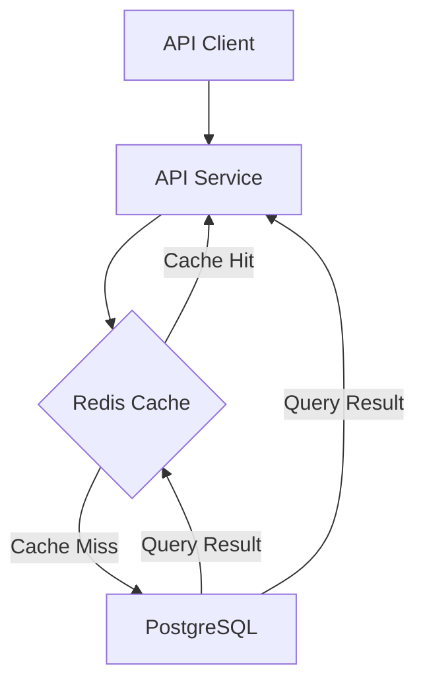

# RFC (Request for Comments) Guidance

> **Purpose**: This guide provides section-by-section instructions for writing high-quality RFCs. It explains how to use Universal Discovery output and what questions to ask for each section.

---

## Universal Discovery Integration

> **CRITICAL**: RFCs are created AFTER completing Phase 1 (Universal Discovery) and Phase 2 (Document Type Selection). The Problem Validation Gate must be completed before writing this RFC.

### Universal Discovery Output → RFC Section Mapping

| Universal Discovery Output | Used In RFC Section | How It's Used |
|----------------------------|---------------------|---------------|
| Current State description | Motivation → Current State | Core content for "what happens now" |
| Evidence type + metrics | Motivation → Problem Statement | "How do we know" - quantifies impact |
| Who is affected | Motivation → Current State | "Who experiences this" |
| Desired State description | Motivation → Desired State | "What does done look like" |
| State Gap | Motivation → Problem Statement | Success metrics from gap analysis |
| Pain Point (worst thing) | Motivation → Problem Statement | Priority framing |
| Impact Urgency | Motivation → Problem Statement | Cost of inaction |
| Related Documents | References | Linked/attached context |
| Historical Context | Alternatives Considered | Previous attempts inform new design |
| Technical Context | Architecture Overview | System landscape and constraints |
| Team Context | Implementation Plan | Team capacity and ownership |

### Before Starting the RFC

**Prerequisites:**
1. ✅ Problem Validation Gate completed (current state, evidence, who's affected, gap analysis)
2. ✅ Document type selection confirmed (AI recommended RFC, user accepted)
3. ✅ Template-specific discovery questions answered (RFC-specific questions from agent)

---

## Section-by-Section Guidance

### 1. Abstract

**Purpose**: Quick summary for readers to understand what this RFC is about without reading the entire document.

**Length**: 2-3 sentences

**Key Elements**:
- What is being proposed
- Why it matters (problem it solves)
- Expected outcome

**RFC-Specific Questions**:
- "If someone reads only the abstract, what should they understand?"
- "What's the elevator pitch for this change?"

**Quality Criteria**:
- Stands alone without rest of document
- Includes problem + solution + benefit
- Under 100 words

**Example**:
> This RFC proposes adding Redis caching to our API layer to reduce database load. The current system queries the database on every request, causing 2-3 second latency during peak traffic. This change will reduce latency to <200ms and decrease database CPU usage by 60%. Implementation affects the API service and requires cache invalidation strategy.

---

### 2. Motivation

**Purpose**: Convince readers that this change is necessary and important.

**Uses Universal Discovery Output**: This is the primary section that uses validated problem information.

#### Current State

**What to Include**:
- Detailed description of what happens now
- Evidence that this is a problem (metrics, complaints, errors)
- Who is affected and how

**Uses Universal Discovery**:
- **Current State Deep Dive** output → "What happens now" description
- **Evidence of Problem** output → Quantified impact with metrics
- **Who Has This Problem** output → Affected users/services

**RFC-Specific Questions**:
- "What does the broken workflow look like step by step?"
- "Can you quantify the impact? (errors per hour, latency, users affected)"
- "Who notices this problem? (users, teams, services)"

**Quality Criteria**:
- Specific, not vague ("API takes 2-3 seconds" not "API is slow")
- Evidence-backed (metrics, logs, complaints)
- Clear connection between problem and affected parties

**Example**:
> **What happens now:** Every API request queries the PostgreSQL database directly. During peak hours (9AM-11AM PST), the database serves 5000 requests/second.
>
> **Evidence of problem:**
> - API p95 latency increased from 100ms to 2800ms over past 3 months
> - Support receives 20+ tickets/week about slow page loads
> - Database CPU consistently at 85%+, causing query timeouts
>
> **Who is affected:** All users, especially mobile users on poor network connections. Enterprise sales team reports deals lost due to slow dashboard loading.

#### Desired State

**What to Include**:
- Clear description of what "fixed" looks like
- How you'll know the problem is solved
- Success criteria from gap analysis

**Uses Universal Discovery**:
- **Desired State** output → "What should happen" description
- **State Gap** output → Success metrics

**RFC-Specific Questions**:
- "What does success look like? Be specific."
- "What metrics will improve? By how much?"
- "What's the gap between current and desired state?"

**Quality Criteria**:
- Measurable success criteria
- Clear "before vs after" comparison
- Realistic expectations

**Example**:
> **What should happen:** Frequently-accessed data (user profiles, product catalogs) should be served from Redis cache with 95%+ hit rate. Database queries should only occur for cache misses or write operations.
>
> **The gap:** Today, 100% of requests hit the database. Target is <5% cache miss rate. This reduces database load from 5000 req/s to <250 req/s.

#### Problem Statement

**What to Include**:
- One-sentence current state
- Specific pain/impact
- One-sentence desired state
- Cost of inaction (urgency)

**Uses Universal Discovery**:
- **Current State** (one-sentence)
- **Desired State** (one-sentence)
- **Pain Point Specificity** (worst thing)
- **Impact Urgency** (cost of not fixing)

**RFC-Specific Questions**:
- "What's the single worst thing about the current situation?"
- "If you could fix ONE thing, what would it be?"
- "What's the cost of NOT fixing this? (revenue, time, frustration, technical debt)"
- "Is this getting worse over time, or stable?"

**Quality Criteria**:
- Problem statement is clear and specific
- Impact is quantified (not just "it's slow")
- Urgency is justified (why NOW?)

**Example**:
> Today, every API request hits the database directly, causing 2-3 second latency during peak hours and 85%+ database CPU usage. This causes mobile user churn and lost enterprise deals. We need a caching layer that serves frequently-accessed data from memory. The cost of not fixing this is $50K/month in lost revenue (churn analysis) and escalating database costs.

---

### 3. Proposed Design

**Purpose**: Describe the solution at a high level before diving into details.

**RFC-Specific Questions**:
- "What are we building?"
- "How does this solve the problem stated in Motivation?"
- "What are the key architectural decisions?"

**Quality Criteria**:
- Clear connection between problem and solution
- Understandable by both technical and non-technical readers
- Covers all major components of the solution

**Content Structure**:
1. **High-Level Overview**: 2-3 paragraph description of the solution
2. **Architecture Overview**: Diagram + component relationships
3. **Key Components**: Table of components with purposes
4. **Data Flow**: How data moves through the system

**Example (High-Level Overview)**:
> We propose adding Redis as a caching layer between the API service and PostgreSQL. The API will check Redis before querying the database. Cache misses will query PostgreSQL and populate Redis for subsequent requests. Cache invalidation will use TTL-based expiration with write-through updates for critical data.

---

### 4. Architecture Overview

**Purpose**: Visual and detailed description of system architecture after this change.

**RFC-Specific Questions**:
- "What are the system boundaries?"
- "How do components interact?"
- "What are the key dependencies?"

**Quality Criteria**:
- Includes architecture diagram (use `/common-engineering:mermaid`)
- All components labeled with purposes
- Data flow is clear
- External dependencies are identified

**Diagram Requirements**:
- Use mermaid for diagrams
- Show components, data flow, and dependencies
- Label new vs existing components
- Include error flows

**Example Mermaid Structure**:

---

### 5. Implementation Plan

**Purpose**: Break down the work into manageable phases with clear ownership.

**Uses Universal Discovery**:
- **Team Context** → Team assignments and ownership
- **Technical Context** → Technical dependencies

**RFC-Specific Questions**:
- "What are the logical phases of implementation?"
- "What can be done in parallel vs serial?"
- "Who will own each phase?"
- "What are the dependencies between phases?"

**Quality Criteria**:
- Phases are logically ordered (dependencies respected)
- Each phase has clear goals and success criteria
- Ownership is assigned
- Effort estimates are included
- Riskiest work is done early

**Phase Structure**:
- **Phase Name**: Descriptive name
- **Goals**: What this phase accomplishes
- **Tasks**: Checklist of work items
- **Owner**: Team/person responsible
- **Estimated effort**: Time estimate
- **Dependencies**: What must come before this phase
- **Deliverables**: What's produced by end of phase

**Example Phase**:
> ### Phase 1: Redis Infrastructure
> - **Goals:** Deploy Redis cluster, establish monitoring
> - **Tasks:**
>   - [ ] Provision Redis cluster in production VPC
>   - [ ] Configure Redis persistence and backups
>   - [ ] Set up Redis monitoring (metrics, alerts)
>   - [ ] Document Redis operations procedures
> - **Owner:** Platform Team
> - **Estimated effort:** 2 weeks
> - **Dependencies:** None (can start immediately)
> - **Deliverables:** Operational Redis cluster, runbooks, monitoring dashboard

---

### 6. Migration Strategy

**Purpose**: How do we transition from current to new system safely?

**RFC-Specific Questions**:
- "What changes to the current system are required?"
- "Can we run both systems in parallel?"
- "What happens if migration fails?"
- "How do we rollback?"

**Quality Criteria**:
- Migration method is clearly specified (big bang, phased, parallel, blue-green)
- Backwards compatibility is addressed
- Rollback is planned
- Data migration is specified (if applicable)
- Client impact is minimized

**Migration Methods**:

| Method | When to Use | Risk | Rollback Difficulty |
|--------|-------------|------|---------------------|
| Big Bang | Simple changes, low risk, no critical data | High | Easy (complete revert) |
| Phased | Complex changes, can be incrementally deployed | Medium | Medium (revert each phase) |
| Parallel Run | Critical systems, need A/B validation | Low | Hard (data reconciliation) |
| Blue-Green | Zero-downtime required, easy rollback | Low | Easy (switch back) |

**Content Structure**:
1. **Current System Decommissioning**: What changes, when, how
2. **Data Migration**: What data, how moved, rollback plan
3. **Backwards Compatibility**: API changes, grace period, deprecation timeline

**Example**:
> **Migration method:** Phased rollout with feature flags
>
> **Phase 1:** Deploy code with caching disabled (feature flag off). No behavior change.
> **Phase 2:** Enable caching for 1% of traffic (feature flag on for 1%). Monitor metrics.
> **Phase 3:** Gradually increase traffic: 10% → 50% → 100% based on metrics.
> **Rollback:** Turn feature flag off at any point to disable caching instantly.
>
> **Backwards compatibility:** No API changes. Existing clients unaffected.

---

### 7. Rollback Plan

> **CRITICAL**: Every RFC MUST include a rollback plan. This is non-negotiable.

**RFC-Specific Questions**:
- "Under what conditions do we rollback?"
- "What are the rollback triggers?"
- "How do we rollback step by step?"
- "How do we confirm rollback was successful?"
- "Has rollback been tested?"

**Quality Criteria**:
- Rollback triggers are specific (not "if something goes wrong")
- Rollback procedure is step-by-step and unambiguous
- Rollback validation is specified
- Rollback has been tested (or test plan is documented)
- Rollback time is estimated

**Rollback Triggers Examples**:
- p95 latency increases by >50% for 5 minutes
- Error rate exceeds 1% for 2 minutes
- Cache hit rate < 50% for 10 minutes
- Manual trigger (oncall decision)

**Rollback Procedure Example**:
1. Disable feature flag `enable_redis_cache` (instant, takes <1 second)
2. Verify API latency returns to baseline (expect within 30 seconds)
3. Verify error rate returns to baseline (expect within 1 minute)
4. Confirm with monitoring dashboard
5. Post incident note explaining rollback

**Rollback Testing**:
- **Test plan:** Enable caching in staging, monitor for 1 hour, disable, verify baseline returns
- **Test results:** [Fill in after testing] ← ADD THIS

---

### 8. Testing Strategy

**Purpose**: How do we validate this implementation works correctly?

**RFC-Specific Questions**:
- **Unit tests:** What's tested? What's the coverage target?
- **Integration tests:** How are service interactions tested?
- **Performance tests:** What metrics are validated? How is load tested?
- **Rollback tests:** How is rollback tested? ← CRITICAL

**Quality Criteria**:
- All testing types are covered (unit, integration, performance, rollback)
- Coverage targets are specified
- Performance testing matches production load patterns
- **Rollback testing is documented and executed** ← NON-NEGOTIABLE

**Testing Structure**:

1. **Unit Tests**
   - Coverage target (e.g., 80% for new code, 90% for critical paths)
   - Key scenarios to test
   - Mock external dependencies (Redis, database)

2. **Integration Tests**
   - Test service interactions
   - Test with real Redis (staging environment)
   - Test cache hit/miss scenarios
   - Test cache invalidation

3. **Performance Tests**
   - Metrics to validate (latency, throughput, resource usage)
   - Performance targets (p95 latency < 200ms)
   - Load testing approach (simulate 5000 req/s for 1 hour)

4. **Rollback Tests**
   - **Test plan:** [How rollback will be tested]
   - **Test results:** [Actual outcomes - fill after testing]
   - **Rollback test is NON-NEGOTIABLE**

**Example**:
> **Rollback Testing:**
> - **Test plan:** In staging, enable caching at 100% traffic for 1 hour. Monitor all metrics. Then disable feature flag. Verify all metrics return to baseline within 1 minute.
> - **Test results:** [Scheduled for week 3, owned by QA team]

---

### 9. Performance Considerations

**Purpose**: What is the expected performance impact of this change?

**RFC-Specific Questions**:
- **Expected impact:** Will latency increase or decrease? By how much?
- **Resource usage:** CPU, memory, storage, network impact?
- **Monitoring:** What metrics will be tracked?
- **Alerting:** What triggers alerts?

**Quality Criteria**:
- Performance impact is quantified (not "should be faster")
- Resource usage is estimated
- Monitoring and alerting are specified
- Performance targets are documented (for success criteria)

**Content Structure**:
1. **Expected Performance Impact**: Latency, throughput, resource usage
2. **Monitoring**: Key metrics, dashboard location
3. **Alerting**: Thresholds, who gets notified

**Example**:
> **Expected Performance Impact:**
> - **Latency:** p95 API latency: 2800ms → 200ms (93% reduction)
> - **Throughput:** API can handle 2x current load with same resources
> - **Resource usage:** Database CPU: 85% → 30%; Redis CPU: ~20%; API CPU: +5% (cache logic overhead)
>
> **Monitoring:**
> - **Key metrics:** API latency (p50, p95, p99), cache hit rate, Redis CPU, database CPU
> - **Dashboard:** [Link to Grafana dashboard]
> - **Alerting thresholds:** p95 latency > 500ms, cache hit rate < 70%

---

### 10. Security Considerations

**Purpose**: What are the security risks and how are they mitigated?

**RFC-Specific Questions**:
- **Security risks:** What new attack vectors are introduced?
- **Compliance:** Any PII/sensitive data concerns? Regulatory requirements?
- **Authentication/Authorization:** Any access control changes?

**Quality Criteria**:
- Security risks are identified in a table
- Each risk has likelihood, impact, and mitigation
- Compliance requirements are addressed
- Access control changes are documented
- Security review is scheduled (if required)

**Risk Table Format**:

| Risk | Likelihood | Impact | Mitigation |
|------|------------|--------|------------|
| Cache poisoning | Medium | High | Validate cache keys, enforce size limits, monitor for anomalies |
| PII in cache | Low | High | Audit cached data types, encrypt at rest, TTL limits |

**Example**:
> **Security Risks:**
>
> | Risk | Likelihood | Impact | Mitigation |
> |------|------------|--------|------------|
> | PII in Redis cache | Low | High | Audit cached data; no PII cached or encrypt at rest; TTL max 1 hour |
> | Cache key injection | Low | Medium | Validate cache keys; enforce size limits; no user input in keys |
> | DoS via cache churn | Medium | Medium | Rate limit per-user; max cache size per user; monitor eviction rate |
>
> **Compliance:**
> - **Data privacy:** No PII will be cached. All cached data is non-sensitive (product catalogs, user profiles).
> - **Regulatory:** SOC2 audit requires encryption at rest. Redis will enable encryption.
> - **Audit requirements:** All cache accesses logged for security review.
>
> **Authentication/Authorization:**
> - No access control changes. API auth unchanged. Redis access restricted to API service IP only.

---

### 11. Alternatives Considered

**Purpose**: Show that other options were evaluated and justify why the proposed solution is best.

**Uses Universal Discovery**:
- **Historical Context** → Previous attempts and why they failed
- **Related Documents** → Reference attached docs

**RFC-Specific Questions**:
- "What other approaches were considered?"
- "Why weren't they chosen?"
- "What would make us reconsider those alternatives?"

**Quality Criteria**:
- At least 2 alternatives are documented (mandatory)
- Each alternative has pros and cons
- Clear rationale for why proposed solution is best
- Previous attempts (if any) are referenced

**Alternative Structure**:
1. **Alternative Name**
   - Description (what it proposes)
   - Pros (why it's good)
   - Cons (why it's bad)
   - Why not chosen (rationale)

2. **Chosen Alternative**
   - Why this is the best choice

**Example**:
> ### Alternative 1: Memcached Instead of Redis
>
> **Description:** Use Memcached as the caching layer instead of Redis.
>
> **Pros:**
> - Simpler architecture (no persistence)
> - Lower operational overhead
> - Slightly faster (no persistence overhead)
>
> **Cons:**
> - No persistence (cache is lost on restart)
> - No advanced data structures
> - Limited eviction policies
>
> **Why not chosen:** We need cache persistence for disaster recovery. Redis persistence ensures cache survives restarts, reducing database load spike risk.
>
> ### Alternative 2: Database Query Optimization Only
>
> **Description:** Optimize PostgreSQL queries and indexes instead of adding caching.
>
> **Pros:**
> - No new infrastructure
> - Simpler architecture
> - Addresses root cause (slow queries)
>
> **Cons:**
> - Limited improvement (queries are already optimized)
> - Database still bottleneck at scale
> - Doesn't reduce read load significantly
>
> **Why not chosen:** Analysis shows queries are already optimized (using proper indexes). The bottleneck is query volume, not query speed. Only caching reduces read load.
>
> ### Chosen Alternative: Redis Caching Layer
>
> **Why this is the best choice:**
> - Addresses the root problem (excessive database read load)
> - Proven technology (used by X, Y, Z companies)
> - Persistence ensures cache survives restarts
> - Team has Redis experience (lower operational risk)
> - Can be rolled out incrementally with feature flags

---

### 12. Risks and Mitigations

**Purpose**: Identify what could go wrong and how to handle it.

**RFC-Specific Questions**:
- "What could go wrong during implementation?"
- "What could go wrong in production?"
- "How do we mitigate each risk?"
- "Which risks are acceptable vs deal-breakers?"

**Quality Criteria**:
- Risks are identified in a table
- Each risk has likelihood, impact, mitigation, and owner
- Risk mitigation summary is provided (overall risk profile)
- High-impact risks have detailed mitigation plans

**Risk Table Format**:

| Risk | Likelihood | Impact | Mitigation Plan | Owner |
|------|------------|--------|-----------------|-------|
| [Risk] | [High/Med/Low] | [Impact] | [Mitigation steps] | [Owner] |

**Example**:
> ### Risk Mitigation Summary
>
> **Overall risk profile:** Medium risk. This is a well-understood pattern (caching) but introduces new operational complexity (Redis). Rollback is fast and simple (feature flag), which reduces risk.
>
> | Risk | Likelihood | Impact | Mitigation Plan | Owner |
> |------|------------|--------|-----------------|-------|
> | Cache invalidation bugs cause stale data | Medium | High | Write-through for critical data; TTL max 1 hour; monitoring for staleness | Backend Team |
> | Redis becomes SPOF | Low | High | Redis cluster with replication; automatic failover; fallback to DB on Redis failure | Platform Team |
> | Cache hit rate lower than expected | Medium | Medium | Gradual rollout with monitoring; abort if hit rate < 70% | Backend Team |
> | Rollback triggered frequently | Low | Medium | Thorough testing in staging; load testing with production-like traffic | QA Team |

---

### 13. Open Questions

**Purpose**: Document questions that need answers before or during implementation.

**RFC-Specific Questions**:
- "What don't we know yet that we need to find out?"
- "Who needs to answer these questions?"
- "Are these questions blockers or can they be answered during implementation?"

**Quality Criteria**:
- Questions are specific and answerable
- Each question has an owner (who will answer)
- Status is tracked (Open, In Progress, Answered)
- Answers are filled in as they're discovered

**Table Format**:

| Question | Asked To | Status | Answer |
|----------|----------|--------|--------|
| [Question] | [Person/Team] | [Open | Answered] | [Answer if known] |

**Example**:
> | Question | Asked To | Status | Answer |
> |----------|----------|--------|--------|
> | What's the maximum acceptable cache staleness for product catalog data? | Product Team | Open | TBD |
> | Should we encrypt Redis at rest? (SOC2 requirement) | Security Team | Answered | Yes, enable encryption |
> | What's the cache key format for user profiles? | Backend Team | In Progress | Proposal: `user:profile:{user_id}` |

---

### 14. Success Metrics

**Purpose**: How do we know this implementation was successful?

**Uses Universal Discovery**:
- **State Gap** → Success metrics from gap analysis
- **Desired State** → Target metrics

**RFC-Specific Questions**:
- "What functional success criteria must be met?"
- "What quantitative metrics will improve?"
- "How will we measure each metric?"
- "When will we evaluate success?"

**Quality Criteria**:
- Functional success criteria are specific (not vague)
- Quantitative metrics have baseline, target, and measurement method
- Success timeline is specified (when to evaluate)
- Metrics tie back to problem statement in Motivation

**Content Structure**:
1. **Functional Success Criteria**: What must work (checklist)
2. **Quantitative Metrics**: Baseline → Target → Measurement
3. **Success Timeline**: When to evaluate

**Example**:
> ### Functional Success Criteria
>
> - [ ] Cache hit rate ≥ 70% for frequently-accessed data
> - [ ] API p95 latency ≤ 200ms during peak hours
> - [ ] Database CPU ≤ 50% during peak hours
> - [ ] Zero data loss incidents (cache staleness acceptable, data corruption not)
> - [ ] Rollback successfully tested in staging
>
> ### Quantitative Metrics
>
> | Metric | Baseline | Target | How Measured |
> |--------|----------|--------|--------------|
> | API p95 latency | 2800ms | ≤200ms | Grafana dashboard (API latency) |
> | Database CPU | 85% | ≤50% | Grafana dashboard (DB metrics) |
> | Cache hit rate | N/A | ≥70% | Grafana dashboard (Redis metrics) |
> | Mobile user churn | 5%/month | ≤3%/month | Product analytics (churn rate) |
>
> ### Success Timeline
>
> Evaluate success 2 weeks after 100% rollout. Final evaluation at 1 month post-rollout to ensure no long-term issues.

---

### 15. References

**Purpose**: Link to related documents, external resources, and context.

**Uses Universal Discovery**:
- **Related Documents** → Link any attached docs from Rich Context Input
- **Historical Context** → Reference previous attempts
- **Technical Context** → Reference system documentation

**RFC-Specific Questions**:
- "What documents should readers review?"
- "What external resources informed this design?"
- "What related RFCs/ADRs exist?"

**Quality Criteria**:
- Related documents are linked
- Each link has a brief description
- External references are relevant and current
- Previous attempts are referenced (if any)

**Example**:
> ### Related Documents
>
> - [ADR: Cache Invalidation Strategy 2023](/docs/adr/cache-invalidation-2023.md) - Previous failed attempt at caching; explains why cache invalidation was difficult
> - [TSD: API Service Architecture](/docs/tsd/api-service-arch.md) - Current API architecture and data flow
> - [Production Incident: Database Overload 2024-08-15](/incidents/2024-08-15-db-overload.md) - Incident that prompted this RFC
>
> ### External References
>
> - [Redis Caching Best Practices](https://redis.io/docs/manual/patterns/) - Redis documentation on caching patterns
> - [Facebook's Scaling Memcached at Facebook](https://www.facebook.com/notes/facebook-engineering/scaling-memcached-at-facebook/10149862073513920/) - Industry case study on large-scale caching

---

### 16. Appendix

**Purpose**: Additional context that doesn't fit in main sections but is useful for readers.

**RFC-Specific Questions**:
- "What terms need definitions?"
> "What implementation details are useful but not essential?"

**Quality Criteria**:
- Glossary defines domain-specific terms
- Implementation details are accurate and helpful
- Appendix is truly optional (main document stands alone)

**Content Structure**:
1. **Glossary**: Define technical terms
2. **Implementation Details**: Additional technical context

**Example**:
> ### Glossary
>
> | Term | Definition |
> |------|------------|
> | Cache Hit Rate | Percentage of requests served from cache vs database |
> | Write-Through | Cache update strategy: write to cache and DB simultaneously |
> | TTL (Time To Live) | Expiration time for cached data in seconds |
> | Cache Churn | Rate at which cache entries are evicted and replaced |
>
> ### Implementation Details
>
> **Cache Key Format:**
> - User profiles: `user:profile:{user_id}`
> - Product catalog: `product:catalog:{category_id}`
> - Search results: `search:{query_hash}`
>
> **TTL Values:**
> - User profiles: 1 hour
> - Product catalog: 5 minutes
> - Search results: 15 minutes

---

### 17. Approval

**Purpose**: Document required approvals and track sign-offs.

**RFC-Specific Questions**:
- "Who needs to approve this RFC?"
- "What are the approval criteria for each role?"
- "Can implementation start before all approvals?"

**Quality Criteria**:
- All required roles are listed
- Approval status is tracked
- Dates are recorded when approvals are received

**Common Approval Roles**:
- **Tech Lead**: Technical feasibility review
- **Product Manager**: Business value and priority review
- **Security Review**: Security risks and compliance review
- **SRE/Oncall**: Operational readiness and monitoring review

**Example**:
> | Role | Name | Approval | Date |
> |------|------|----------|------|
> | Tech Lead (Backend) | Jane Smith | ✓ | 2024-09-15 |
> | Product Manager | John Doe | ✓ | 2024-09-16 |
> | Security Review | Security Team | Pending | |
> | SRE/Oncall | Ops Team | Pending | |

---

## Quality Checklist for RFCs

Before submitting an RFC for review, verify:

### Problem Clarity
- [ ] Current state is described in detail (what happens now)
- [ ] Evidence of problem is provided (metrics, logs, complaints)
- [ ] Who is affected is clearly stated
- [ ] Desired state is specific and measurable
- [ ] Gap between current and desired state is clear

### Solution Quality
- [ ] Proposed design clearly connects to problem statement
- [ ] Architecture diagram is included and clear
- [ ] Alternatives were considered (at least 2 documented)
- [ ] Chosen solution is justified vs alternatives

### Implementation Feasibility
- [ ] Implementation plan is phased with clear ownership
- [ ] Migration strategy is specified
- [ ] Rollback plan is detailed and tested ← NON-NEGOTIABLE
- [ ] Testing strategy covers unit, integration, performance, rollback

### Risk Management
- [ ] Security risks are identified with mitigations
- [ ] Performance impact is quantified
- [ ] All risks are documented with likelihood, impact, mitigation
- [ ] Overall risk profile is summarized

### Success Criteria
- [ ] Functional success criteria are specific
- [ ] Quantitative metrics have baseline, target, measurement method
- [ ] Success timeline is specified

### Documentation Quality
- [ ] All sections are complete
- [ ] References are linked
- [ ] Glossary defines domain terms (if needed)
- [ ] Approval roles are identified

---

## Common RFC Mistakes to Avoid

1. **Problem is vague**: "Performance is slow" → Bad. "API p95 latency increased from 100ms to 2800ms" → Good.
2. **No rollback plan**: Every RFC MUST have a rollback plan. Non-negotiable.
3. **Alternatives not considered**: Must document at least 2 alternatives with rationale.
4. **Testing is missing**: Must specify unit, integration, performance, AND rollback testing.
5. **Success metrics are vague**: "Performance will improve" → Bad. "p95 latency will decrease from 2800ms to ≤200ms" → Good.
6. **Security is an afterthought**: Security considerations must be addressed explicitly.
7. **No monitoring plan**: Must specify what metrics are tracked and where.
8. **Migration is unsafe**: Must consider backwards compatibility and safe rollout.
